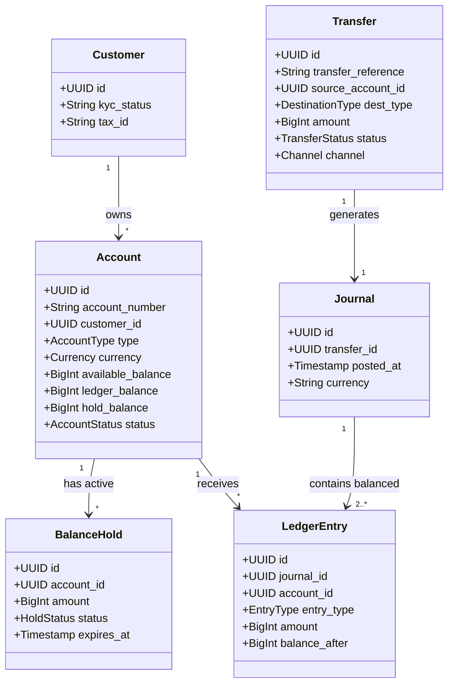

# Core Banking Engine — API Architecture & Integration Blueprint

<!--
  name: core_banking_api_blueprint.md
  description: High-level & Low-level architectural specification for a Core Banking Engine API.
               Covers Double-Entry Ledger, Account State Machines, Idempotency Engine, 
               Outbox Clearing Pipeline, and EOD 3-Way Reconciliation.
-->

> **Domain**: Core Banking / Payments & Ledger Subsystem  
> **Standard**: OpenAPI 3.1, RFC 7807 (Problem Details), ISO 20022 Financial Messaging  
> **Security Level**: Tier-1 Mission Critical (mTLS + OAuth2 RS256 + PCI-DSS / Financial Audit)

---

## 1. Domain & Resource Modeling

The Core Banking Engine represents the single source of truth for all account balances, financial movements, and double-entry ledger postings.



### Core Entities & REST Resources:

1. **Accounts (`/v1/accounts`)**:
   - Manages demand deposit (checking), savings, escrow, and internal bank clearing/settlement accounts.
   - Differentiates strictly between:
     - `ledger_balance`: Cleared accounting balance.
     - `hold_balance`: Funds reserved for pending operations.
     - `available_balance`: `ledger_balance - hold_balance + overdraft_limit`.

2. **Balance Holds (`/v1/holds`)**:
   - Allows temporary balance reservations (e.g., POS authorizations, ATM withdrawal pending capture) without settling in the general ledger immediately.

3. **Transfers (`/v1/transfers`)**:
   - **Internal Book Transfer**: Atomic move between two accounts in the same bank.
   - **Interbank Transfer**: Debits customer account, credits internal Nostro/Clearing account, and passes instruction to the clearing network (e.g., NAPAS 24/7, CITAD, SWIFT).

4. **Immutable Ledger Postings (`/v1/accounts/{id}/entries`)**:
   - Append-only journal entries. No record is ever updated or deleted. Reversals create opposite balancing entries.

---

## 2. Fundamental Architectural Guarantees

### 2.1 Double-Entry Bookkeeping Principle
Every financial transaction generates a balanced `Journal` with at least two `LedgerEntry` items:

$$\sum \text{Debits} = \sum \text{Credits}$$

- **Deposit Accounts (Liability from bank perspective)**:
  - `DEBIT`: Decreases customer balance (money leaves account).
  - `CREDIT`: Increases customer balance (money enters account).
- **Clearing / Nostro Accounts (Asset/Intermediary)**:
  - Holds outbound clearing funds until interbank switch acknowledges settlement.

---

### 2.2 Strict ACID Transaction & Concurrency Control
To eliminate race conditions and double-spending across distributed instances:

1. **Pessimistic Row-Level Locking (`SELECT FOR UPDATE`)**:
   - Source account row is locked in the relational database during transfer evaluation.
   - Accounts are ordered by UUID lexicographically before locking to prevent deadlocks in bidirectional transfers.
2. **Read-Committed or Repeatable Read Isolation Level**:
   - Guarantees phantom reads and dirty writes cannot alter balance computations.

---

### 2.3 Idempotency Engine
- Every mutating request (`POST /transfers`, `POST /holds`, `POST /accounts`) **requires an `Idempotency-Key` header** (UUID v4).
- Distributed cache (Redis with Redlock or DB constraint) verifies the key:
  - **New Request**: Locks key, processes transaction, stores result payload with 48h TTL.
  - **Duplicate Request (Same payload)**: Instantly returns cached HTTP response without re-executing business logic.
  - **Collision (Same key, different payload)**: Rejects with `409 Conflict`.

---

## 3. Asynchronous Interbank Clearing Pipeline

For external transfers (e.g., NAPAS 24/7, FAST, SWIFT), the core banking engine uses the **Transactional Outbox Pattern** to ensure zero data loss during network crashes:

```
[Core Banking API] ──(Atomic DB Transaction)──> [Ledger DB + Outbox Table]
                                                        │
                                                        ▼ (CDC / Debezium / Poller)
                                                 [Message Queue (Kafka)]
                                                        │
                                                        ▼
                                              [Clearing Worker]
                                                        │
                                                 (ISO 20022 PACS.008)
                                                        ▼
                                            [Interbank Switch (NAPAS / SWIFT)]
```

- **Instant Acknowledgement**: API immediately commits local debit, writes to Outbox, and returns `202 Accepted` to client.
- **Worker Execution**: Worker calls external switch with a strict 5s timeout, circuit breaker, and exponential backoff.
- **Automated Reversal**: If the destination bank rejects the clearing message, the worker executes a compensating transaction (Reversal Journal) to credit funds back to the sender.

---

## 4. End-of-Day (EOD) 3-Way Reconciliation

Every hour and at End-of-Day (EOD), an automated reconciliation batch performs a 3-way match:

| Source A (Internal Ledger) | Source B (Clearing Switch Log) | Source C (Nostro Account Statement) | Match Status | Action |
|---|---|---|---|---|
| Record Present (Status: COMPLETED) | Record Present (Success) | Amount Matches | ✅ BALANCED | Settle batch |
| Record Present (Status: PROCESSING) | Record Present (Success) | Amount Matches | ⚠️ MISSED WEBHOOK | Auto-update internal ledger to COMPLETED |
| Record Present (Status: PROCESSING) | Record Not Found | Not Debited | ❌ FAILED CLEARING | Trigger Compensating Reversal |
| Record Not Found | Record Present | Debited | 🚨 CRITICAL ORPHAN | Place into Suspense Account & Page Operations |

---

## 5. Security, Auditability & Compliance

1. **Zero-Trust Network Isolation**:
   - Core Banking APIs are strictly deployed in private VPC subnets.
   - External access is mediated by API Gateway with WAF and DDoS mitigation.
2. **Mutual TLS (mTLS)**:
   - Required for all client-to-gateway and service-to-service communication using Hardware Security Module (HSM) or Vault managed certificates.
3. **Immutability & Audit Trails**:
   - All balance mutations record `operator_id` or `client_id`, `X-Request-ID`, and IP hash.
   - DB CDC stream pushes all ledger mutations to WORM (Write Once, Read Many) tamper-evident storage for regulatory audit.
4. **RFC 7807 Standard Error Codes**:
   - Uniform error representation with localized problem URIs (e.g., `https://api.banking.example.com/errors/insufficient-available-funds`).
