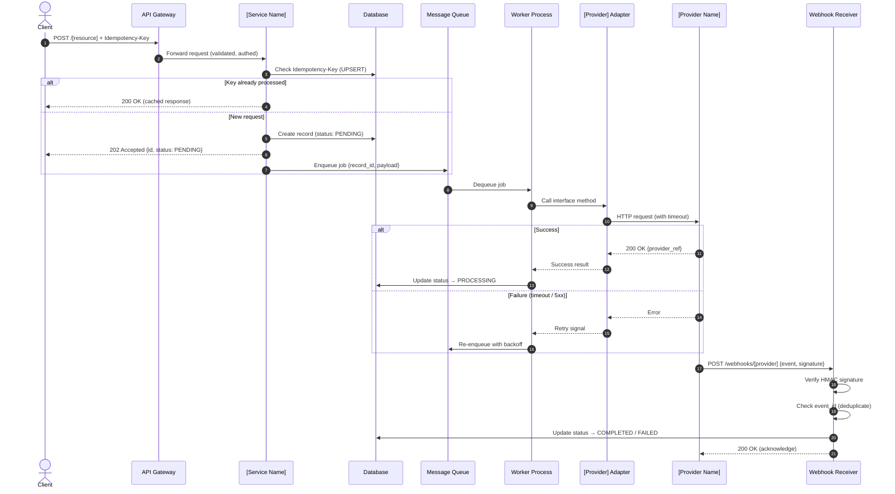

# Integration Strategy: [Provider Name]

<!--
  name: template_integration_strategy.md
  description: Stakeholder-facing integration strategy document template.
               Fill in all [PLACEHOLDERS] for the specific integration.
               Produced during Step 7 of the API & Integration Design skill.
-->

> **Status**: Draft | Review | Approved  
> **Author**: [Team Name]  
> **Date**: [YYYY-MM-DD]  
> **Version**: 1.0

---

## 1. Integration Objective

### Business Context
[Describe why this integration is needed. What business problem does it solve? What user journey does it enable?]

**Example**: Enable customers to complete purchases using VNPay's domestic payment network, supporting ATM cards, internet banking, and QR code payment methods.

### Provider Selection Rationale
| Criterion | This Provider | Alternative |
|---|---|---|
| Market coverage | [e.g., 90% Vietnamese banks] | [e.g., 70%] |
| Fee structure | [e.g., 1.5% per transaction] | [e.g., 2.0%] |
| Reliability (SLA) | [e.g., 99.95% uptime] | [e.g., 99.9%] |
| Integration complexity | [e.g., Medium] | [e.g., Low] |
| Compliance certifications | [e.g., PCI-DSS Level 1] | [e.g., PCI-DSS Level 2] |

---

## 2. Integration Architecture

### Communication Pattern
- **Pattern**: ✅ Asynchronous (Recommended for payment/SMS) | ☐ Synchronous
- **Rationale**: [Explain why async was chosen — e.g., "Provider SLA is 3s average; synchronous would block the user thread and degrade UX. Async via queue allows immediate `202 Accepted` to client."]

### Sequence Diagram



---

## 3. Idempotency Strategy

| Aspect | Detail |
|---|---|
| **Header** | `Idempotency-Key: <UUID v4>` |
| **Generated by** | Client (consumer of this API) |
| **Storage** | Redis with TTL |
| **TTL** | 24 hours |
| **Key collision behavior** | Same payload → return cached `202 Accepted` response. Different payload → `409 Conflict`. |
| **Webhook idempotency** | Deduplicate by provider's `event_id`. Store processed event IDs in Redis for 48 hours. |

---

## 4. Error Handling & Retry Policy

### Outbound Requests (to Provider)

| Parameter | Value | Rationale |
|---|---|---|
| **Connection Timeout** | 3s | Fail fast; do not hold worker thread |
| **Read Timeout** | 5s | Allow provider time to process |
| **Max Retry Attempts** | 3 | Beyond 3, move to DLQ for manual review |
| **Backoff Strategy** | Exponential with jitter | Prevent thundering herd |
| **Backoff Formula** | `min(cap, base × 2^attempt) + random(0, 1000ms)` | Example: 1s → 2s → 4s → DLQ |
| **Retryable conditions** | `5xx`, `429`, `Connection Timeout`, `Read Timeout` | |
| **Non-retryable conditions** | `4xx` (except `429`) | Client error; retry won't help |

### Circuit Breaker

| Threshold | Value |
|---|---|
| **Window** | 60 seconds |
| **Error rate to OPEN** | ≥ 50% error rate over 10+ calls |
| **Half-Open probe interval** | 30 seconds |
| **Recovery requirement** | 3 consecutive successful probes |

**States:**
- `CLOSED` (normal) → requests flow through.
- `OPEN` (tripped) → immediately return error / activate fallback; no calls to provider.
- `HALF-OPEN` (probing) → allow 1 test request; if success → CLOSED; if fail → re-OPEN.

### Fallback Provider
- **Primary**: [Provider Name]
- **Fallback**: [Fallback Provider Name or "Manual Review Queue"]
- **Activation condition**: Circuit Breaker enters OPEN state for > [X] minutes.
- **Fallback behavior**: [Describe what happens — e.g., "Route to Momo adapter" or "Queue for manual processing and notify operations team."]

---

## 5. Webhook Contract

### Receiver Endpoint
```
POST https://api.example.com/v1/webhooks/[provider-slug]
```

### Authentication & Signature Verification

| Step | Detail |
|---|---|
| **Algorithm** | HMAC-SHA256 |
| **Signature header** | `X-[Provider]-Signature: sha256=<hex_digest>` |
| **Secret source** | Environment variable `[PROVIDER]_WEBHOOK_SECRET` (never hardcoded) |
| **Verification formula** | `HMAC-SHA256(raw_request_body, secret) == signature_header_value` |

**Replay protection:**
1. Check `timestamp` field in payload. Reject if `|now - timestamp| > 300s` (5 minutes).
2. Check `event_id` against Redis deduplication set (TTL: 48h). Reject duplicates with `200 OK` (acknowledge but do not reprocess).

### Webhook Processing Rules
- Must respond `200 OK` within **5 seconds** (most providers retry on timeout).
- Acknowledgement (`200 OK`) and actual processing are decoupled — acknowledge immediately, process asynchronously via internal queue.
- Store all raw webhook payloads for audit purposes (minimum 90 days).

### Event Types

| Event | Trigger | Action |
|---|---|---|
| `[provider].payment.completed` | Successful payment | Update record status → `COMPLETED`; emit `PaymentCompleted` domain event |
| `[provider].payment.failed` | Failed payment | Update record status → `FAILED`; notify user |
| `[provider].payment.refunded` | Refund processed | Update record status → `REFUNDED`; trigger refund workflow |

---

## 6. Reconciliation Strategy

**Purpose**: Detect and resolve cases where the webhook was not delivered, causing the internal record status to remain `PENDING` or `PROCESSING` indefinitely.

| Aspect | Detail |
|---|---|
| **Frequency** | Every 1 hour (cron) |
| **Data source** | Provider's transaction query API |
| **Look-back window** | Last 2 hours of `PENDING` / `PROCESSING` records |
| **Match logic** | Query provider by internal `reference_id` stored at record creation |
| **Mismatch action** | Update internal status to match provider's source-of-truth + alert operations |
| **Provider SLA for query API** | [e.g., 99.9% — document provider's guarantee] |

**Alert Condition**: If reconciliation finds > [X] mismatches in a single run, trigger a PagerDuty/Slack alert to the on-call engineer.

---

## 7. Security & Compliance

### Data Ownership Boundary (PCI-DSS)

| Data Type | Allowed to Store Internally? | What to Store Instead |
|---|---|---|
| Primary Account Number (PAN / Card Number) | ❌ NEVER | Provider-issued token |
| CVV / CVC | ❌ NEVER | — |
| Full magnetic stripe data | ❌ NEVER | — |
| OTP / PIN | ❌ NEVER | — |
| Cardholder name | ⚠️ Consult compliance team | — |
| Provider transaction reference ID | ✅ YES | `provider_transaction_id` |
| Provider payment token | ✅ YES | `provider_token` |
| Transaction amount & currency | ✅ YES | Standard fields |
| Transaction timestamp | ✅ YES | Standard fields |

### Secret Management
- All provider API keys and webhook secrets stored in **HashiCorp Vault** or equivalent (AWS Secrets Manager, GCP Secret Manager).
- Secrets are **never** hardcoded in source code or committed to version control.
- Secrets rotated on a **90-day** schedule or immediately upon suspected compromise.

### Audit Logging
- All outbound requests to the provider (request + response) logged with `request_id` and `provider_transaction_id`.
- All inbound webhooks (raw payload + verification result) logged.
- Logs retained for **minimum 1 year** (financial audit requirement).

---

## 8. Rollback Plan

### Emergency Kill Switch
- A **feature flag** (`feature.payment.[provider].enabled`) controls routing to this provider.
- Setting the flag to `false` immediately routes all payment requests to the fallback provider or returns a user-friendly `503 Service Temporarily Unavailable` with a retry-after estimate.
- Flag management: [LaunchDarkly / ConfigCat / simple DB flag — specify tool].

### Manual Fallback Flow
If both primary and fallback providers are unavailable:
1. Display user-facing message: "Payment is temporarily unavailable. Please try again in [X] minutes."
2. Do NOT charge the user — maintain record in `PENDING` state.
3. Operations team to process pending transactions manually via provider's dashboard once service is restored.
4. Post-recovery: Reconciliation job will auto-detect and update record statuses.

### Activation Criteria
Trigger rollback when any of the following occur:
- Circuit Breaker stays OPEN for > 10 consecutive minutes.
- Error rate > 10% over a 5-minute window (production SLA breach).
- Provider announces a scheduled maintenance window.
- Security incident involving provider credentials.
