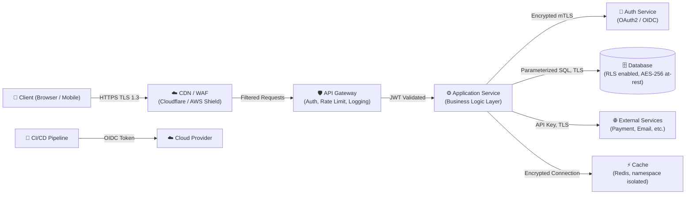

# Security Architecture Design Document

<!--
name: template_security_architecture
description: Output template for generating a Security Architecture Design Document for new systems. Includes architecture diagram, trust boundaries, access control matrix, secure coding guidelines, and incident response reference.
-->

**Project Name:** `____________________`
**Version:** `1.0`
**Date:** `____________________`
**Author / Security Reviewer:** `____________________`
**Status:** `[ ] Draft  [ ] Under Review  [ ] Approved`

---

## 1. Executive Summary
Provide a 3–5 sentence overview describing:
- The system's business purpose.
- The primary data assets and their sensitivity.
- The key security architecture decisions made and the reasoning behind them.

---

## 2. System Overview & Architecture Diagram

Provide a high-level architecture diagram using Mermaid. Show all major components, data flows, and security control points.

**Trust Boundary Summary:**

| Boundary | From | To | Controls |
|---|---|---|---|
| Internet Edge | Client | CDN/WAF | TLS 1.3, DDoS protection, IP filtering |
| API Entry | CDN | API Gateway | Rate limiting, JWT validation, WAF rules |
| Service Layer | API Gateway | App Services | JWT re-validation, request schema validation |
| Data Access | App Service | Database | Parameterized queries, least-privilege DB user, TLS |
| Deploy | CI/CD | Cloud | OIDC federation, no long-lived keys |

---

## 3. Compliance & Regulatory Requirements

| Standard | Applicable? | Specific Controls Required |
|---|---|---|
| PCI-DSS | | |
| HIPAA | | |
| GDPR | | |
| Vietnam NĐ 13/2023 | | |
| SOC 2 | | |
| ISO 27001 | | |

---

## 4. Data Classification & Encryption Policy

| Data Type | Classification | Storage Encryption | Transit Encryption | Retention Policy |
|---|---|---|---|---|
| User PII (name, email) | Confidential | AES-256 | TLS 1.2+ | [X] days after account deletion |
| Authentication credentials | Restricted | bcrypt/argon2 hash | TLS 1.2+ | Rotated on password change |
| Payment card data | Restricted | Tokenized (PCI-DSS) | TLS 1.2+ | Not stored if tokenized |
| Session tokens | Restricted | In-memory only | HTTPS cookies | Invalidated on logout |
| Application logs | Internal | Volume encryption | N/A | [X] days |
| Audit logs | Restricted | Signed + immutable store | N/A | [X] years per compliance |

---

## 5. Access Control Matrix (RBAC)

Define which roles can perform which actions on which resources.

| Resource | Endpoint | Anonymous | Authenticated User | Admin | Service Account |
|---|---|---|---|---|---|
| Public content | `GET /api/content` | ✅ Read | ✅ Read | ✅ Read | ✅ Read |
| User profile | `GET /api/users/:id` | ❌ | ✅ Own only | ✅ All | ❌ |
| User profile | `PUT /api/users/:id` | ❌ | ✅ Own only | ✅ All | ❌ |
| Admin settings | `GET /api/admin/*` | ❌ | ❌ | ✅ All | ❌ |
| Billing records | `GET /api/billing` | ❌ | ✅ Own only | ✅ All | ✅ Read |
| User deletion | `DELETE /api/users/:id` | ❌ | ❌ | ✅ All | ❌ |

*Add rows as required for all sensitive endpoints and resources.*

---

## 6. Secure Coding Guidelines

These are the language-specific and framework-specific rules for this project.

### 6.1 General Rules (All Languages)
- Never trust user-supplied data. Validate on the server with whitelist schemas.
- Never log passwords, tokens, or PII.
- Never catch and silently ignore exceptions in authentication or authorization flows.
- All database queries must use parameterized statements or ORM abstractions.

### 6.2 Language-Specific Rules
*(Fill in based on project stack.)*

**Python (FastAPI / Django):**
- Use `argon2-cffi` or `passlib` for password hashing.
- Use `sqlalchemy` with bound parameters; avoid raw `text()` with user input.
- Use `pydantic` models to validate and sanitize all request bodies.

**Node.js (Express / NestJS):**
- Use `bcrypt` for password hashing; minimum `saltRounds=12`.
- Use `joi` or `zod` for request validation.
- Use `parameterized` queries with `pg` or `mysql2`; never string-concatenate SQL.
- Set `helmet()` middleware to secure HTTP headers.

**Dart / Flutter (Mobile):**
- Store tokens in `flutter_secure_storage` — never in `SharedPreferences`.
- Validate SSL certificates; implement certificate pinning with `http_certificate_pinning`.
- Encrypt local SQLite with `sqflite_sqlcipher`.

---

## 7. Secrets & Configuration Management

| Secret Type | Storage Method | Rotation Policy | Owner |
|---|---|---|---|
| Database password | Vault / Secrets Manager | Every 90 days | DevOps |
| API keys (third-party) | Vault / Secrets Manager | On compromise or annually | Developer |
| JWT signing keys | Vault / Secrets Manager | Every 6 months | Security |
| TLS certificates | Let's Encrypt (auto-renew) | Auto (90 days) | DevOps |
| CI/CD pipeline secrets | CI platform secret store | Every 90 days | DevOps |

---

## 8. Monitoring, Alerting & Audit Logging

| Event | Log Level | Alert Triggered? | Retention |
|---|---|---|---|
| Successful user login | INFO | No | 30 days |
| Failed login (>5 in 5 min) | WARN | Yes — notify Security | 90 days |
| Admin privilege escalation | WARN | Yes — notify Security | 1 year |
| Data export / bulk download | AUDIT | Yes — notify Data Owner | 1 year |
| Secret or config change | AUDIT | Yes — notify Security | 2 years |
| Infrastructure change (IaC apply) | AUDIT | Yes — notify DevOps | 2 years |

---

## 9. Incident Response Quick Reference

> Keep this section short and actionable — a developer must be able to act in the first 5 minutes of an incident.

| Incident Type | First Response | Contact |
|---|---|---|
| Suspected credential leak | Invalidate all active sessions immediately. Rotate affected secrets. | Security Lead |
| Suspected API key exposure | Revoke the key in the provider dashboard. Check logs for unauthorized usage. | Security Lead |
| Unauthorized data access (IDOR) | Block the affected endpoint. Capture request logs for forensics. | Security Lead + Legal |
| DDoS / Availability attack | Enable rate limiting boost at CDN layer. Scale compute if needed. | DevOps On-call |
| Third-party supply chain compromise | Freeze dependency updates. Pin to last known good version. Apply patch. | Security Lead |
