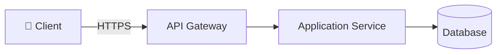

# Vulnerability Assessment Report

<!--
name: template_vulnerability_report
description: Output template for generating a Vulnerability Assessment Report for existing systems. Includes architecture as-is, executive summary, findings table, and remediation roadmap.
-->

**Project Name:** `____________________`
**Report Version:** `1.0`
**Assessment Date:** `____________________`
**Assessor:** `____________________`
**Classification:** `[ ] Internal  [ ] Confidential  [ ] Restricted`

---

## 1. Executive Summary

Provide a concise summary (5–10 sentences) covering:
- Scope and methods used in this assessment (automated scanning, manual review, gitignore audit, etc.).
- Total number of findings by severity.
- The single most critical risk and why it requires immediate action.
- Overall security posture rating: `[ ] Critical  [ ] High  [ ] Medium  [ ] Low / Acceptable`

**Finding Summary:**

| Severity | Count | Requires Immediate Action? |
|---|---|---|
| 🔴 Critical | | Yes — before any further deployment |
| 🟠 High | | Yes — before next release |
| 🟡 Medium | | Within current quarter |
| 🔵 Low | | Backlog — address when convenient |
| ℹ️ Informational | | No action required; noted for awareness |

---

## 2. Scope of Assessment

| Area | Included | Notes |
|---|---|---|
| Source code SAST scan | | Paths scanned: `____` |
| Gitignore and repository hygiene audit | | |
| Dependency vulnerability scan (SCA) | | |
| Configuration review (IaC, Docker, K8s manifests) | | |
| Manual architecture review | | |
| API endpoint review | | |
| Cloud configuration review (CSPM) | | |
| Penetration testing | | |

---

## 3. Current Architecture (As-Is)

Describe the system's current data flows and deployed security controls.



*Update this diagram to accurately reflect the current production architecture, including real control points, missing controls, and identified gaps.*

**Identified Security Control Gaps:**

| Component | Expected Control | Current State | Gap |
|---|---|---|---|
| API Gateway | Rate limiting | Not configured | ❌ Missing |
| Database | Encrypted at-rest | Not enabled | ❌ Missing |
| Application | Secret Vault | Secrets in `.env` files | ⚠️ Partial |

---

## 4. Findings

For each finding, complete the following table. Order by severity (Critical first).

---

### Finding #[N]: [Short Title]

| Field | Value |
|---|---|
| **ID** | VULN-[N] |
| **Severity** | 🔴 Critical / 🟠 High / 🟡 Medium / 🔵 Low |
| **Category** | e.g., Secrets Exposure, Broken Access Control, Injection, Misconfiguration |
| **OWASP Reference** | e.g., A02:2021 — Cryptographic Failures |
| **Component / File** | e.g., `src/config/database.py:L45` |
| **Discovered By** | e.g., `general_security_scanner.py`, Manual review, `gitignore_checker.py` |

**Description:**
Describe the vulnerability in detail — what the issue is, where it was found, and why it is a risk.

**Evidence / Proof of Concept:**
```
# Paste relevant code snippet, log output, or scanner finding here
```

**Attack Scenario:**
Describe a concrete, realistic attack scenario: who is the attacker, what steps they take, and what the impact would be.

**Remediation:**
Provide specific, actionable steps to fix the issue.

**Remediation Command (if applicable):**
```bash
# e.g., remove tracked secret from Git history
git rm --cached .env
echo ".env" >> .gitignore
git commit -m "fix: remove .env from version control"
```

**References:**
- OWASP: [relevant link]
- CWE-[ID]: [description]

---

## 5. Findings Register (Full Table)

| ID | Title | Severity | Category | Component | Status | Owner | Target Fix Date |
|---|---|---|---|---|---|---|---|
| VULN-001 | | 🔴 Critical | | | ⬜ Open | | |
| VULN-002 | | 🟠 High | | | ⬜ Open | | |
| VULN-003 | | 🟡 Medium | | | ⬜ Open | | |

**Status legend:** ⬜ Open · 🔄 In Progress · ✅ Resolved · ⏸️ Accepted Risk

---

## 6. Gitignore & Repository Hygiene Audit

Results from running `scripts/gitignore_checker.py --dir .`

| Check | Status | Details |
|---|---|---|
| `.gitignore` file exists | ✅ / ❌ | |
| `.env` patterns are ignored | ✅ / ❌ | |
| `*.pem`, `*.key` patterns are ignored | ✅ / ❌ | |
| `node_modules/`, `venv/` are ignored | ✅ / ❌ | |
| IDE/OS configs (`.vscode/`, `.DS_Store`) are ignored | ✅ / ❌ | |
| Build outputs (`dist/`, `build/`) are ignored | ✅ / ❌ | |
| Sensitive files currently tracked by Git | ✅ Clean / ❌ Found: `[list files]` | |

**Remediation for tracked sensitive files:**
```bash
# Remove the file from Git tracking without deleting the local copy
git rm --cached <file_path>
echo "<file_pattern>" >> .gitignore
git commit -m "fix: remove sensitive file from Git tracking"
```

---

## 7. Remediation Roadmap

| Priority | Finding ID | Description | Owner | Target Date | Effort Estimate |
|---|---|---|---|---|---|
| P0 — Immediate | | | | | |
| P1 — Before Next Release | | | | | |
| P2 — This Quarter | | | | | |
| P3 — Backlog | | | | | |

---

## 8. Reassessment Plan

Describe when and how the team will verify that the findings have been remediated:
- **P0/Critical**: Verify within 48 hours of reported fix by re-running automated scans.
- **P1/High**: Verify before the next scheduled release deployment.
- **P2/Medium**: Verify at the next quarterly security review.
- **Full Reassessment**: Schedule a complete reassessment in `[X]` months.
