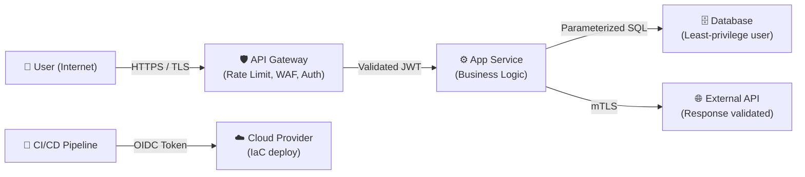

# Threat Modeling Templates

<!--
name: threat_modeling_templates
description: STRIDE and DREAD threat modeling templates with worked examples and trust-boundary mapping guidelines. Use during Step 3 of the security architecture engagement.
-->

## STRIDE Framework Overview

STRIDE is a mnemonic for six categories of threats. Apply it by walking through each data flow in the system and asking: can this flow be exploited under each category?

| Category | Threat Description | Primary Controls |
|---|---|---|
| **S**poofing | Impersonating a legitimate user, service, or component | MFA, mTLS, client certificate pinning, signed JWTs |
| **T**ampering | Modifying data in-transit or at-rest | TLS 1.2+, HMAC, digital signatures, database integrity constraints |
| **R**epudiation | Denying that an action was performed | Immutable audit logs, cryptographic log signing, non-repudiation systems |
| **I**nformation Disclosure | Exposing data to unauthorized parties | AES-256 encryption, field-level encryption, output masking, RBAC |
| **D**enial of Service | Making the system unavailable | Rate limiting, DDoS protection, circuit breakers, redundancy (Multi-AZ) |
| **E**levation of Privilege | Gaining higher permissions than authorized | Least Privilege, RBAC/ABAC/ReBAC, validated IDOR checks |

---

## STRIDE Threat Model Worksheet

Fill in this table for each major data flow or component in the system.

**System / Component Being Analyzed:** `____________________`
**Date:** `____________________`
**Analyst:** `____________________`

| # | Data Flow / Component | Threat Category | Threat Description | Likelihood (1–5) | Impact (1–5) | Risk Score | Current Control | Mitigation Action |
|---|---|---|---|---|---|---|---|---|
| 1 | | Spoofing | | | | | | |
| 2 | | Tampering | | | | | | |
| 3 | | Repudiation | | | | | | |
| 4 | | Info Disclosure | | | | | | |
| 5 | | Denial of Service | | | | | | |
| 6 | | Elevation of Privilege | | | | | | |

---

## STRIDE Worked Example: User Login Flow

| # | Data Flow | Threat | Description | Likelihood | Impact | Risk Score | Control | Action |
|---|---|---|---|---|---|---|---|---|
| 1 | User → `/api/auth/login` | Spoofing | Attacker uses stolen credentials to impersonate a user | 4 | 5 | 20 | Password hash | Enforce MFA via TOTP/WebAuthn |
| 2 | Auth token → Client | Tampering | JWT payload is modified to elevate privileges | 2 | 5 | 10 | JWT signed HS256 | Upgrade to RS256; validate `alg` header |
| 3 | Login event | Repudiation | User denies performing sensitive action | 2 | 3 | 6 | Application logs | Add immutable audit log with timestamp + IP |
| 4 | Auth service → DB | Info Disclosure | SQL error response leaks schema info | 3 | 4 | 12 | Generic error pages | Ensure errors are caught and sanitized at the handler level |
| 5 | Login endpoint | Denial of Service | Brute-force login floods the endpoint | 5 | 3 | 15 | None | Add rate limiting (100 req/min per IP) and account lockout |
| 6 | JWT token | Elevation of Privilege | Attacker forges `role: admin` by exploiting weak signing | 2 | 5 | 10 | HMAC-signed JWT | Enforce RS256; validate role claims server-side |

---

## Trust Boundary Mapping

A trust boundary is a line in the system across which data or control flows from one trust zone to another. Every crossing is a potential attack surface.

**Common Trust Boundaries to identify:**
1. **Internet → API Gateway**: All external HTTP requests. Primary injection point.
2. **API Gateway → Application Services**: Internal routing. Validate tokens again at the service level.
3. **Application Service → Database**: High-value target. Use parameterized queries and least-privilege credentials.
4. **Application → External Third-Party API**: Do not trust responses blindly. Validate response schemas.
5. **CI/CD Pipeline → Production Cloud**: Highest privilege flow. Secure with OIDC federation, not long-lived keys.
6. **LLM Agent → Tool Calls**: Agent outputs are untrusted user input. Validate all arguments before execution.

**Trust Boundary Diagram (Mermaid template):**

---

## DREAD Risk Scoring Model (Supplementary)

DREAD provides a numeric score for prioritizing vulnerabilities:

| Dimension | Scale | Description |
|---|---|---|
| **D**amage Potential | 1–3 | How severe is the impact if exploited? (1=minor, 3=catastrophic) |
| **R**eproducibility | 1–3 | How easy is it to reproduce the exploit? (1=difficult, 3=trivial) |
| **E**xploitability | 1–3 | How much skill is required to exploit it? (1=expert, 3=script kiddie) |
| **A**ffected Users | 1–3 | How many users are affected? (1=single user, 3=all users) |
| **D**iscoverability | 1–3 | How easy is the vulnerability to find? (1=hidden, 3=publicly exposed) |

**DREAD Score = D + R + E + A + D (max 15)**

| Score Range | Priority |
|---|---|
| 12–15 | Critical — Immediate fix required |
| 8–11 | High — Fix before next release |
| 4–7 | Medium — Fix in current quarter |
| 1–3 | Low — Track and monitor |

**DREAD Worksheet:**

| Vulnerability | Damage | Reproducibility | Exploitability | Affected Users | Discoverability | Total | Priority |
|---|---|---|---|---|---|---|---|
| | | | | | | | |
