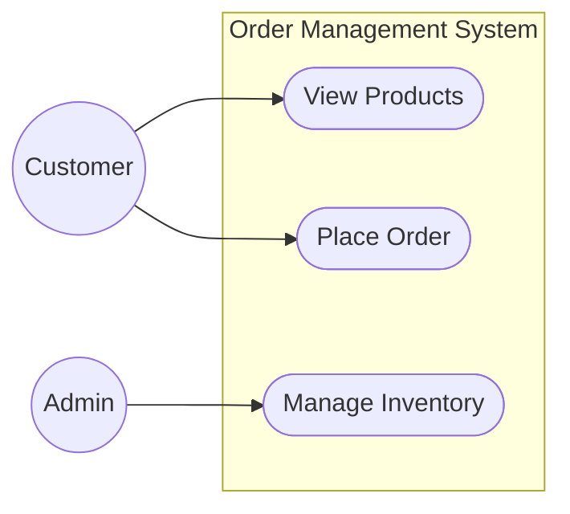
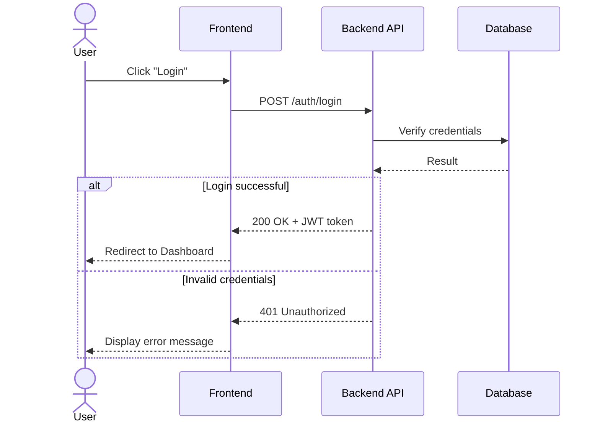
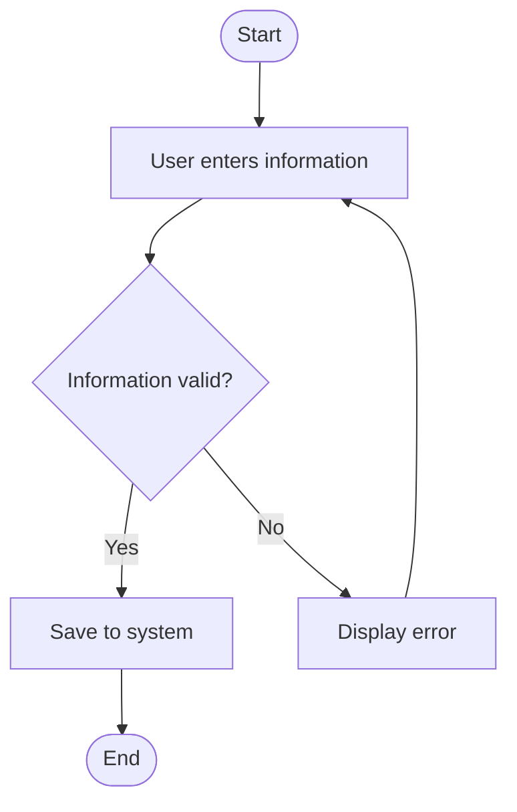
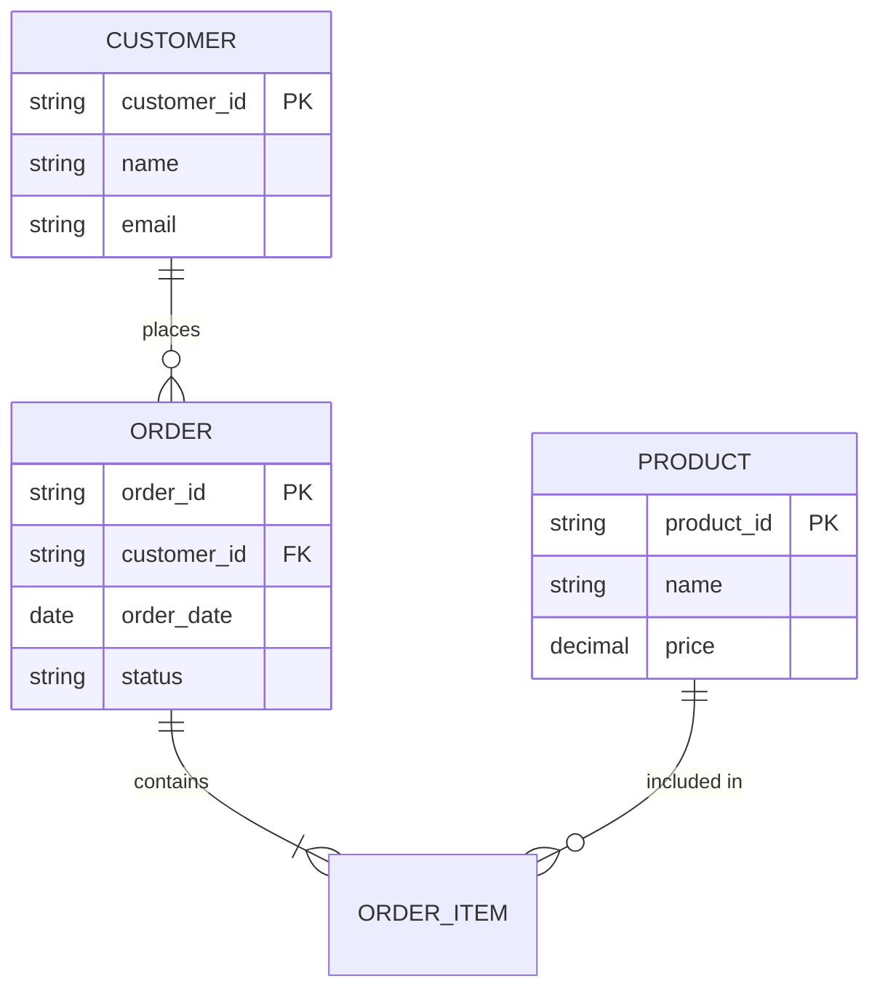
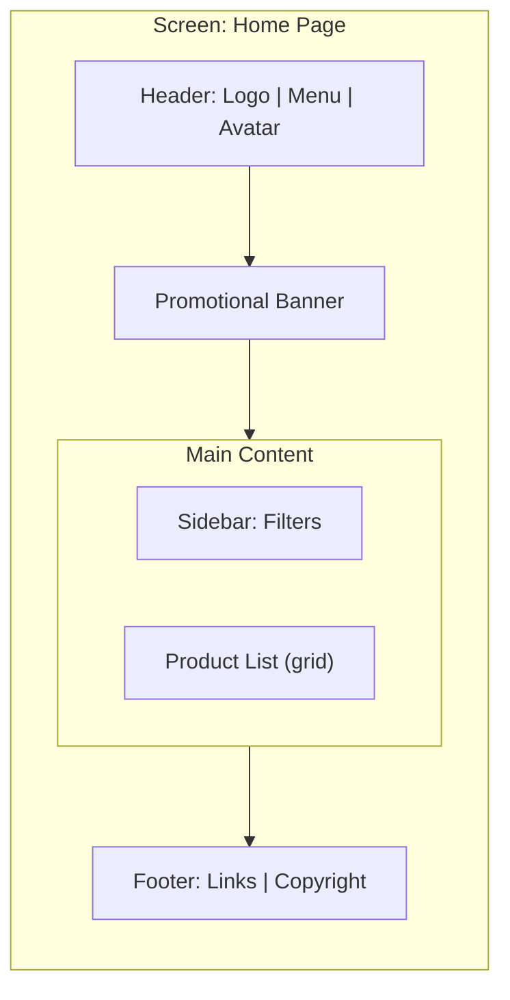

# Mermaid Diagram Snippets for SA Documentation

Use the right diagram type for the right purpose. Place code blocks with ` ```mermaid ``` ` in your `.md` files — most renderers (GitHub, GitLab, VSCode preview…) will display them natively.

## 1. Use Case Diagram

Mermaid does not have a native UML use case notation; simulate it using `flowchart` with actor nodes (use subgraphs to group use cases within the system boundary):



## 2. Sequence Diagram



## 3. Activity Diagram (using flowchart)



## 4. ERD (Entity Relationship Diagram)



## 5. Wireframe (simulated with block layout)

Mermaid does not have a real wireframe engine — use `flowchart` with rectangular boxes representing layout regions, and clearly note that this is a low-fidelity mockup, not a real UI. If the user needs higher fidelity (actual colors, spacing), recommend switching to a visualization tool or HTML mockup rather than Mermaid.



## Diagram Selection Guide
| Purpose | Diagram Type |
|---|---|
| Who does what with the system | Use Case |
| Interaction flow between components over time | Sequence |
| Business process flow / decision logic | Activity (or BPMN-style flowchart) |
| Data structure / table relationships | ERD |
| Screen layout at a rough level | Block-layout flowchart (not a substitute for Figma) |
