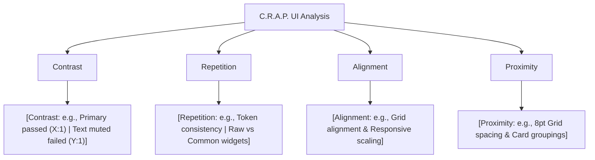

<!--
  name: review_template.md
  description: UX/UI Analysis & Accessibility Audit Report Template.
               Fill in all [PLACEHOLDER] values when performing design audits.
               Evaluates interfaces against C.R.A.P. UI Framework, 13 Core UX Principles,
               and WCAG 2.1 AA Accessibility Guidelines.
-->

# Audit Execution Workflow

> **Reviewer Guidelines:** Before compiling this report, execute the following verification steps:
> 1. **Color Contrast Verification:**
>    Measure color contrast ratios for key background/foreground pairs:
>    ```bash
>    node .agent/skills/design-ux-ui/scripts/contrast_checker.js "<background-hex>" "<foreground-hex>"
>    # Or if running from within the skill directory:
>    node scripts/contrast_checker.js "<background-hex>" "<foreground-hex>"
>    ```
> 2. **Accessibility & Semantics Inspection:**
>    Scan codebase for `Semantics`, `aria-label`, `Tooltip`, `IconButton`, and touch target constraints ($48 \times 48\,\text{dp}$ / $44 \times 44\,\text{pt}$).
> 3. **Design System Consistency Check:**
>    Detect fragmentation between raw framework widgets and shared design system components.
> 4. **Code References:** Always provide clickable markdown links in `[filename.ext:L__](file:///path/to/file#L__)` format.

---

# UX/UI Analysis & Accessibility Audit — [Project / Module Name]

> **Status:** `[ ] Draft` / `[ ] In Review` / `[ ] Completed`  
> **Date:** YYYY-MM-DD  
> **Evaluator:** [Evaluator Name / AI Agent]  
> **Target Scope:** `[e.g., /app/mobile or /src/features/dashboard]`  
> **Standards Applied:** C.R.A.P. Framework · 13 Core UX Principles · WCAG 2.1 AA  
> **Audit Tools:** `contrast_checker.js` · Static Code & Theme Analysis · Semantics Scanner  

---

## 1. C.R.A.P. UI Framework Analysis



### 1.1. Contrast (Visual Hierarchy & Contrast Ratios)
* **Strengths:** 
  * [List tokens/elements meeting WCAG AA (≥ 4.5:1 for body text, ≥ 3.0:1 for large text/UI icons) or AAA (≥ 7.0:1), with measured ratios and file links, e.g., `[AppColors.primary](file:///path/to/app_colors.ext#L10)` (`#HEX`) on background (`#HEX`) achieves **X.X:1**].
* **Areas for Improvement:**
  * [List tokens/elements failing WCAG AA, e.g., `[AppColors.warning](file:///path/to/app_colors.ext#L25)` (`#HEX`) on background (`#HEX`) achieves only **X.X:1** (fails $\ge 4.5:1$)].

### 1.2. Repetition (Consistency & Design System)
* **Strengths:** [Identify consistent patterns across screens — shared tokens, card metaphors, typography scale, border radius].
* **Areas for Improvement:** [Identify fragmentation — e.g., mixed usage of raw framework widgets (`AppBar`, `ElevatedButton`, `TextField`) vs design system common widgets (`AppHeader`, `AppButton`, `AppTextField`)].

### 1.3. Alignment (Grid & Spatial Rhythm)
* **Observations:** [Evaluate adherence to grid systems (e.g., 12-column or 8pt baseline grid), responsive scaling units (e.g., `ScreenUtil`, `rem`, `clamp()`), and alignment consistency across mobile, tablet, and desktop viewports].

### 1.4. Proximity (Gestalt Spatial Grouping)
* **Observations:** [Evaluate spacing scale implementation (e.g., 8pt spacing system)]:
  * **Tight spacing (4–12px):** [Internal card element spacing, label-to-input binding].
  * **Medium/Large spacing (16–32px):** [Card-to-card gaps, distinct section separators].

---

## 2. 13 Core UX Principles Evaluation

| # | UX Principle | Codebase Findings & Observations | Rating |
|---|--------------|-----------------------------------|:------:|
| 1 | **User Centricity** | [How well the UI aligns with user mental models and core goals] | `[ ] Good` / `[ ] Needs Work` |
| 2 | **Clarity & Simplicity** | [Cognitive load reduction, prioritization of key actions/metrics] | `[ ] Good` / `[ ] Needs Work` |
| 3 | **Consistency** | [Uniformity of components, typography, interaction patterns] | `[ ] Good` / `[ ] Needs Work` |
| 4 | **Feedback** | [Loading states (Skeleton/Shimmer), transition animations, confirmations] | `[ ] Good` / `[ ] Needs Work` |
| 5 | **Accessibility** | [WCAG compliance, screen reader support, semantic markup] | `[ ] Good` / `[ ] Needs Work` |
| 6 | **Visual Hierarchy** | [Heading scales, surface/background contrast, CTA prominence] | `[ ] Good` / `[ ] Needs Work` |
| 7 | **Usability** | [Thumb Zone placement on mobile, minimal click/tap paths] | `[ ] Good` / `[ ] Needs Work` |
| 8 | **Flexibility & Efficiency** | [Shortcuts, quick filters, support for novice and power users] | `[ ] Good` / `[ ] Needs Work` |
| 9 | **Aesthetic Minimalism** | [Intentional whitespace, distraction-free visual presentation] | `[ ] Good` / `[ ] Needs Work` |
| 10 | **Error Prevention & Recovery** | [Destructive action confirmations, draft preservation, clear error messages] | `[ ] Good` / `[ ] Needs Work` |
| 11 | **Mobile Responsiveness** | [Layout adaptability across breakpoints, safe dynamic text scaling] | `[ ] Good` / `[ ] Needs Work` |
| 12 | **Task-Oriented Design** | [Linear wizards for multi-step flows, contextual guidance] | `[ ] Good` / `[ ] Needs Work` |
| 13 | **Learnability** | [Standardized, intuitive UI patterns requiring minimal onboarding] | `[ ] Good` / `[ ] Needs Work` |

---

## 3. Accessibility Audit (WCAG 2.1 AA)

### 3.1. Color Contrast Verification Log
> Measured using `node scripts/contrast_checker.js <bg_hex> <fg_hex>`

| Element / Color Pair (Background ↔ Foreground) | HEX Pair | Measured Ratio | WCAG AA Standard | Status |
|-----------------------------------------------|:--------:|:--------------:|:----------------:|:------:|
| [e.g., Primary Surface ↔ Brand Primary] | `#______` ↔ `#______` | `___ : 1` | $\ge 4.5:1$ (Normal) | `[PASS / FAIL]` |
| [e.g., Primary Surface ↔ Text Secondary] | `#______` ↔ `#______` | `___ : 1` | $\ge 4.5:1$ (Normal) | `[PASS / FAIL]` |
| [e.g., Primary Surface ↔ Text Muted] | `#______` ↔ `#______` | `___ : 1` | $\ge 4.5:1$ (Normal) | `[PASS / FAIL]` |
| [e.g., Primary Surface ↔ Warning / Status] | `#______` ↔ `#______` | `___ : 1` | $\ge 4.5:1$ (Normal) | `[PASS / FAIL]` |
| [e.g., Primary Surface ↔ Accent Color] | `#______` ↔ `#______` | `___ : 1` | $\ge 4.5:1$ (Normal) / $\ge 3.0:1$ (Large) | `[PASS / FAIL]` |
| [e.g., Dark Surface ↔ Text on Dark] | `#______` ↔ `#______` | `___ : 1` | $\ge 4.5:1$ (Normal) / $\ge 7.0:1$ (AAA) | `[PASS / FAIL]` |

### 3.2. Touch Target Size (SC 2.5.5)
* **Standard:** Minimum **$48 \times 48\,\text{dp}$** (Android) or **$44 \times 44\,\text{pt}$** (iOS).
* **Findings:**
  * [Document interactive elements with undersized touch targets ($< 44\text{pt}$), missing padding, or lack of min-size constraints, referencing `[file_name.ext:L__](file:///path/to/file#L__)`].

### 3.3. Screen Reader & Semantic Support (SC 1.3.1 & SC 4.1.2)
* **Findings:**
  * [Document custom canvases, charts, status indicators, and icon-only buttons lacking `Semantics`, `aria-label`, or accessible descriptions, referencing `[file_name.ext:L__](file:///path/to/file#L__)`].

### 3.4. Dynamic Type & Text Scaling (SC 1.4.4)
* **Findings:**
  * [Document layout truncation, overflow errors, or rigid container heights when system font size is scaled up to 200%].

---

## 4. Heuristic Evaluation (Detailed Findings)

> **Severity Scale:**
> * **0 (Info):** Minor aesthetic observation; no usability impact.
> * **1 (Cosmetic):** Low-priority visual inconsistency.
> * **2 (Minor):** Usability friction or non-blocking standard violation.
> * **3 (Major):** Significant barrier to task completion or accessibility failure.
> * **4 (Catastrophic):** Blocker preventing workflow completion; immediate fix required.

| # | Criterion / Heuristic | Location | Issue Description | Severity | Recommended Remediation |
|---|-----------------------|----------|-------------------|:--------:|-------------------------|
| 1 | [e.g., Accessibility — Contrast] | [`[file_name.ext:L__]`](file:///path/to/file#L__) | [Description of issue] | `[0–4]` | [Actionable fix / code recommendation] |
| 2 | [e.g., Consistency & System] | [`[file_name.ext:L__]`](file:///path/to/file#L__) | [Description of issue] | `[0–4]` | [Actionable fix / code recommendation] |
| 3 | [e.g., Accessibility — Touch Target] | [`[file_name.ext:L__]`](file:///path/to/file#L__) | [Description of issue] | `[0–4]` | [Actionable fix / code recommendation] |
| 4 | [e.g., Accessibility — Semantics] | [`[file_name.ext:L__]`](file:///path/to/file#L__) | [Description of issue] | `[0–4]` | [Actionable fix / code recommendation] |
| 5 | [e.g., Error Prevention & Feedback] | [`[file_name.ext:L__]`](file:///path/to/file#L__) | [Description of issue] | `[0–4]` | [Actionable fix / code recommendation] |

---

## 5. Actionable Remediation Roadmap

```
[Phase 1: Critical Fixes & Token Compliance]
  ├── [Action 1: Fix high-severity contrast violations (WCAG AA)]
  └── [Action 2: Enforce minimum touch target sizes >= 48x48dp]

[Phase 2: Component Standardization & Semantics]
  ├── [Action 3: Replace raw widgets with shared design system components]
  └── [Action 4: Add accessibility labels / Semantics to charts and icon buttons]

[Phase 3: UX Polish & Interaction Refinement]
  ├── [Action 5: Centralize async state & timer management]
  └── [Action 6: Add haptic feedback and transition polish]
```

---

*Report generated with UX/UI Analysis & Design Skill | Standards: C.R.A.P. · 13 UX Principles · WCAG 2.1 AA*
