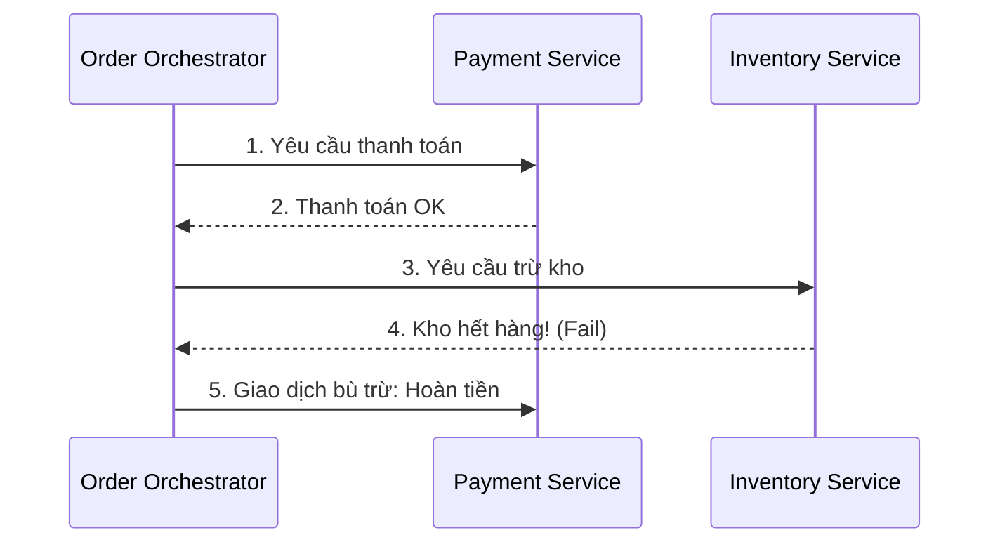
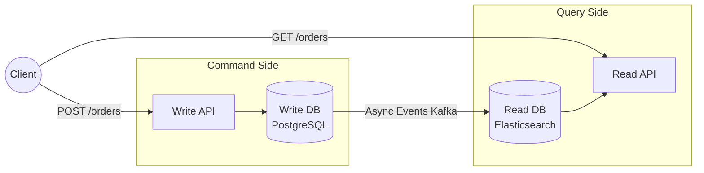
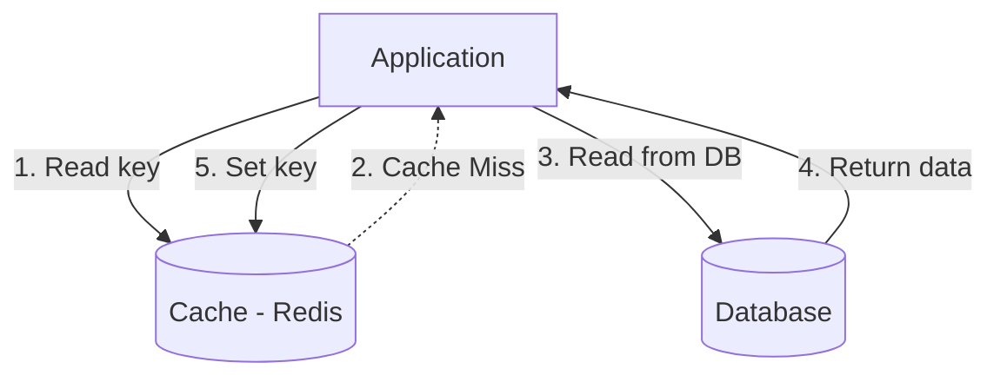
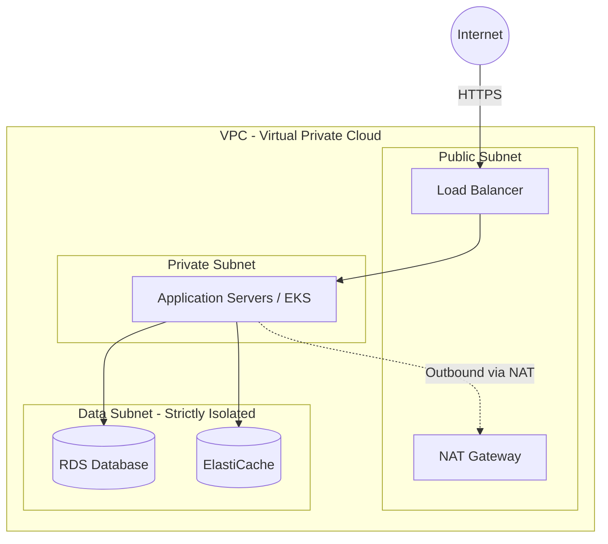

# Data & Cloud Solutions — Sổ tay Kiến trúc Dữ liệu Đám mây

> 💡 **Mục đích:** Tài liệu này là cẩm nang toàn diện về Kiến trúc Dữ liệu trên Cloud và Microservices. Nó giải thích **tại sao** chúng ta cần các pattern phức tạp, minh họa luồng dữ liệu bằng sơ đồ, và cung cấp các tiêu chuẩn đánh giá hệ thống.

---

## 🏗️ Phần 1: Kiến trúc Dữ liệu cho Microservices

### 1.1 Nguyên tắc "Database per Service" (Mỗi service một Database)

Trong kiến trúc nguyên khối (Monolith), tất cả service dùng chung một database. Với Microservices, **mỗi service phải sở hữu database riêng của mình**. Không service nào được phép truy cập trực tiếp vào database của service khác.

**Lý do cốt lõi:**
- **Loose Coupling (Lỏng lẻo):** Đảm bảo tính độc lập. Nếu Service A đổi schema, Service B không bị sập.
- **Polyglot Persistence:** Cho phép chọn loại database tốt nhất cho từng bài toán (ví dụ: Service Tìm kiếm dùng Elasticsearch, Service Thanh toán dùng PostgreSQL).
- **Tránh Single Point of Failure:** Database không còn là điểm nghẽn duy nhất làm sập toàn bộ hệ thống.

**Hệ quả lớn nhất:** Không thể dùng `JOIN` ở tầng database giữa các bảng của các service khác nhau. Dữ liệu phải được "JOIN" ở tầng Application (API Composition) hoặc đồng bộ qua Event (Event-Driven Architecture).

---

### 1.2 Polyglot Persistence — Chọn đúng DB cho đúng việc

Đừng ép mọi thứ vào MySQL hay PostgreSQL. Hãy chọn theo Use-case:

| Loại dữ liệu / Use-case | Loại Database phù hợp | Ví dụ tiêu biểu | Tại sao chọn? |
|---|---|---|---|
| **Giao dịch tài chính, dữ liệu cốt lõi** | Relational (SQL) | PostgreSQL, MySQL | Đảm bảo tính ACID chặt chẽ, schema rõ ràng. |
| **Dữ liệu cấu trúc thay đổi liên tục, linh hoạt** | Document Store | MongoDB, DynamoDB | Lưu trữ JSON linh hoạt, dễ dàng mở rộng theo chiều ngang (scale-out). |
| **Session, Caching, Leaderboard** | Key-Value Store | Redis, Memcached | Tốc độ truy xuất siêu tốc (in-memory). |
| **Mạng xã hội, Hệ thống gợi ý** | Graph Database | Neo4j, Amazon Neptune | Tối ưu cho việc truy vấn mối quan hệ phức tạp, đan chéo. |
| **Tìm kiếm Full-text, Log** | Search Engine | Elasticsearch, OpenSearch | Hỗ trợ phân tích văn bản, tìm kiếm mờ (fuzzy search). |

---

### 1.3 Giữ nhất quán dữ liệu (Data Consistency)

Khi mỗi service có một DB riêng, việc đảm bảo một giao dịch (ví dụ: Đặt hàng -> Trừ tiền -> Trừ kho) thành công toàn vẹn là một bài toán khó. Chúng ta không dùng 2PC (Two-Phase Commit) vì quá chậm. Thay vào đó, dùng các Pattern sau:

#### A. Saga Pattern
Saga là một chuỗi các local transaction (giao dịch cục bộ). Mỗi bước hoàn thành sẽ phát ra một sự kiện (event) để kích hoạt bước tiếp theo. Nếu một bước thất bại, hệ thống sẽ chạy các **compensating transactions** (giao dịch bù trừ) để "rollback" (hoàn tác) các bước trước đó.

**Saga Orchestration (Điều phối tập trung):** Có một "nhạc trưởng" (Orchestrator) ra lệnh cho từng service.

#### B. CQRS (Command Query Responsibility Segregation)
Tách biệt hoàn toàn luồng Ghi (Command) và luồng Đọc (Query).
- **Write Database:** Chuẩn hóa cao (3NF), tối ưu cho Insert/Update (thường là SQL).
- **Read Database:** Denormalized (Lưu trữ phẳng), tối ưu cho Read (thường là NoSQL hoặc Elasticsearch).

*Lưu ý: CQRS luôn đi kèm với Eventual Consistency (Nhất quán cuối).*

---

### 1.4 CAP Theorem — Sự đánh đổi trong hệ thống phân tán

Trong một hệ thống phân tán, bạn không thể có cả 3, mà chỉ có thể tối đa 2 trong 3 đặc tính:
- **C (Consistency - Tính nhất quán):** Mọi client đọc data tại một thời điểm đều thấy giá trị giống nhau (mới nhất).
- **A (Availability - Tính sẵn sàng):** Mọi request đều nhận được response thành công (không bị lỗi), dù data có thể cũ.
- **P (Partition Tolerance - Khả năng chịu lỗi phân vùng):** Hệ thống vẫn chạy ngay cả khi mạng giữa các node bị đứt.

Vì hệ thống phân tán **bắt buộc phải có P**, nên ta luôn phải chọn giữa **CP** hoặc **AP**:
- **Chọn CP:** Ví dụ: Hệ thống chuyển tiền ngân hàng. Nếu mạng đứt, thà báo lỗi (bỏ Availability) còn hơn hiển thị sai số dư (giữ Consistency).
- **Chọn AP:** Ví dụ: Mạng xã hội, Giỏ hàng. Thà hiển thị số lượt Like cũ hoặc giỏ hàng cũ một chút (bỏ Consistency) còn hơn để tính năng không thể truy cập (giữ Availability).

---

## ⚡ Phần 2: Chiến lược Caching (Caching Strategy)

Caching là vũ khí tối thượng để giảm tải cho DB và tăng tốc độ phản hồi.

### 2.1 Các Pattern Caching phổ biến

#### A. Cache-aside (Lazy Loading)
Đây là pattern phổ biến nhất. Application đóng vai trò trung gian giữa Cache và Database.

**Ưu điểm:** Chỉ cache những gì thực sự được dùng. Cache hỏng thì App vẫn sống (đọc thẳng DB).
**Nhược điểm:** Request đầu tiên luôn chậm (Cache Miss).

#### B. Write-through
Khi ghi dữ liệu, ghi đồng thời vào cả Cache và Database.
- **Ưu điểm:** Dữ liệu trong Cache luôn mới nhất, không bao giờ lo stale data (dữ liệu cũ).
- **Nhược điểm:** Việc ghi (Write) sẽ chậm hơn vì phải đợi ghi vào 2 nơi.

#### C. Write-behind (Write-back)
Ứng dụng ghi dữ liệu vào Cache và phản hồi thành công ngay lập tức. Cache sẽ âm thầm đồng bộ xuống DB sau đó (async).
- **Ưu điểm:** Tốc độ Write cực nhanh. Giảm tải Write cho DB nhờ gom nhóm (batching).
- **Nhược điểm:** Nếu Cache sập trước khi đồng bộ, dữ liệu sẽ bị mất vĩnh viễn.

### 2.2 Redis vs Memcached

- Chọn **Memcached** khi: Chỉ cần lưu String, object đơn giản, cần tốc độ thuần túy siêu cao và đa luồng (multi-threaded).
- Chọn **Redis** khi: Cần cấu trúc dữ liệu phức tạp (Hash, Set, Sorted Set cho Leaderboard), cần lưu trữ bền vững (Persistence - ghi xuống đĩa), cần Pub/Sub. (Redis là tiêu chuẩn công nghiệp hiện nay).

---

## ☁️ Phần 3: Kiến trúc Hạ tầng Cloud (AWS / GCP)

### 3.1 Bảng Mapping Dịch vụ AWS ↔ GCP

Dưới đây là bảng ánh xạ các dịch vụ tương đương, giúp bạn thiết kế độc lập với nhà cung cấp:

| Nhóm Dịch vụ | AWS | Google Cloud (GCP) | Use-case |
|---|---|---|---|
| **Máy ảo (VM)** | EC2 | Compute Engine | Ứng dụng legacy, cần control sâu vào OS. |
| **Serverless** | Lambda | Cloud Functions / Cloud Run | Tác vụ chạy nền, xử lý event, cron job. |
| **Container (K8s)** | EKS | GKE | Chạy Microservices chuẩn công nghiệp. |
| **Object Storage** | S3 | Cloud Storage | Lưu trữ file tĩnh, hình ảnh, backup, Data Lake. |
| **SQL Managed** | RDS / Aurora | Cloud SQL / AlloyDB | Cơ sở dữ liệu quan hệ chính của ứng dụng. |
| **NoSQL** | DynamoDB | Firestore / Bigtable | Dữ liệu linh hoạt, scale siêu lớn. |
| **Message Queue** | SQS | Cloud Pub/Sub | Giao tiếp bất đồng bộ giữa các microservices. |
| **IaC** | CloudFormation / CDK | Deployment Manager / Terraform | Quản lý hạ tầng bằng code (Infrastructure as Code). |

### 3.2 Topology Mạng Tiêu chuẩn (VPC Segmentation)

Luôn tuân thủ nguyên tắc **Defense in Depth** (Bảo vệ nhiều lớp) và chia Subnet rõ ràng.

**Luật vàng:** Application Server và Database **TUYỆT ĐỐI KHÔNG** được đặt ở Public Subnet. Phải đặt ở Private Subnet và chỉ nhận traffic từ Load Balancer.

### 3.3 Chiến lược Phục hồi Thảm họa (Disaster Recovery - DR)

Khi datacenter bị cháy hoặc mất điện, bạn khôi phục bằng cách nào?

1. **Backup & Restore (Chi phí thấp nhất):** Lưu backup ở S3, khi có sự cố thì dựng lại hạ tầng từ đầu. RTO (Thời gian phục hồi) tính bằng giờ/ngày.
2. **Pilot Light:** Giữ một bản sao DB thu nhỏ ở region khác luôn chạy. Các app server thì tắt. Khi sự cố xảy ra, bật app server lên. RTO tính bằng chục phút.
3. **Warm Standby:** Chạy một phiên bản thu nhỏ toàn bộ hệ thống (cả App và DB) ở region phụ. Khi sự cố, scale up hệ thống này lên. RTO tính bằng phút.
4. **Multi-site Active-Active (Chi phí đắt nhất):** Cả 2 region cùng chạy 100% công suất và cùng phục vụ user. Nếu 1 bên sập, bên kia gánh hết. RTO gần như bằng 0.

### 3.4 Tối ưu Chi phí (Cost Optimization)
- **On-Demand:** Trả tiền theo giờ. Đắt nhất, dùng cho workload biến động, khó đoán.
- **Reserved / Savings Plans:** Cam kết dùng 1-3 năm, giảm giá 30-60%. Dùng cho DB hoặc App server chạy 24/7 ổn định.
- **Spot Instances:** Mua năng lực tính toán thừa của AWS với giá rẻ như cho (giảm đến 90%). Nhưng AWS có thể đòi lại server bất cứ lúc nào. Chỉ dùng cho Batch processing, Worker job có khả năng chịu lỗi.
