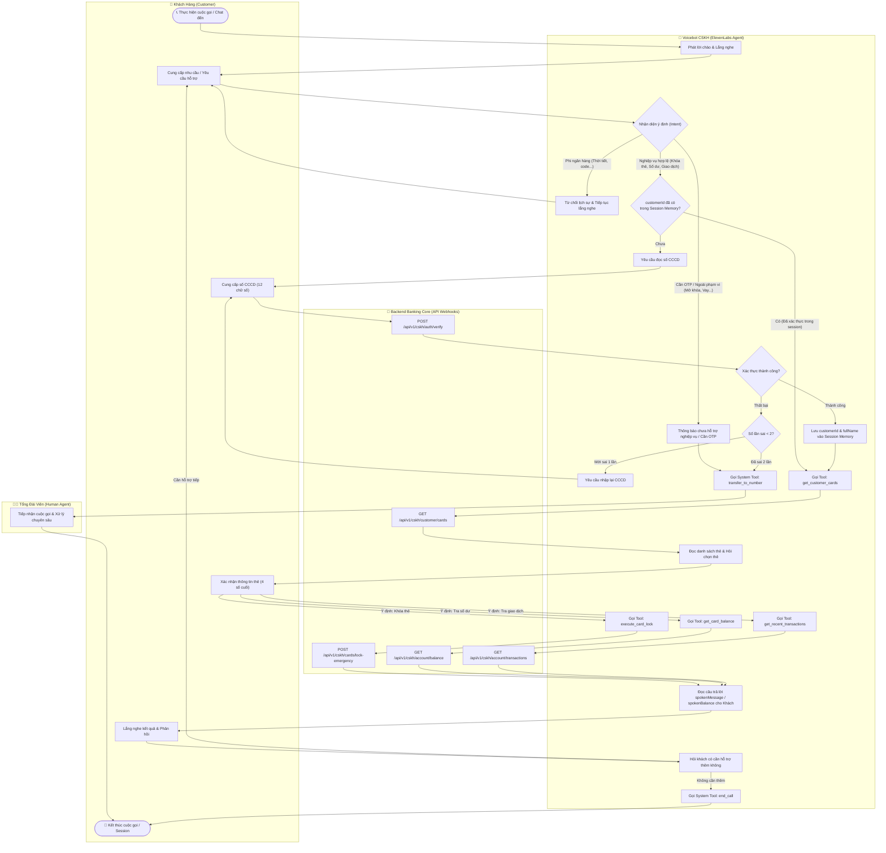
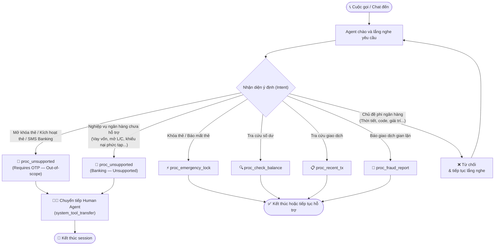
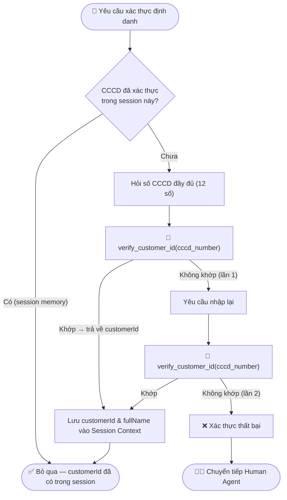
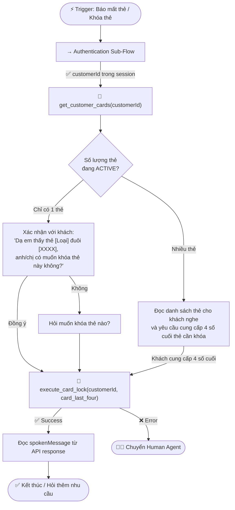
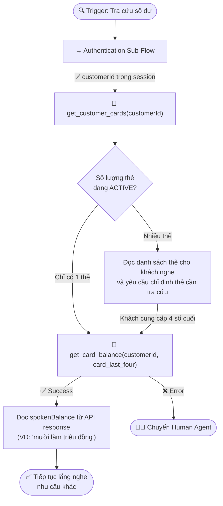
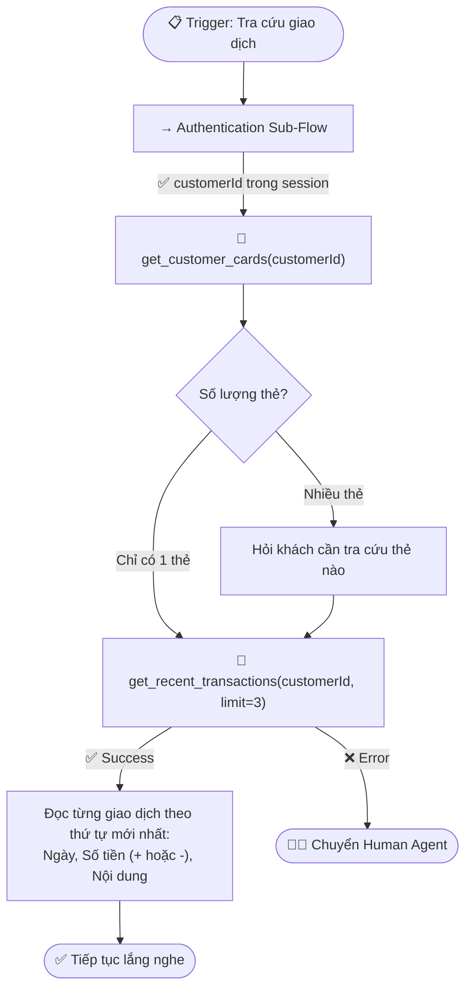
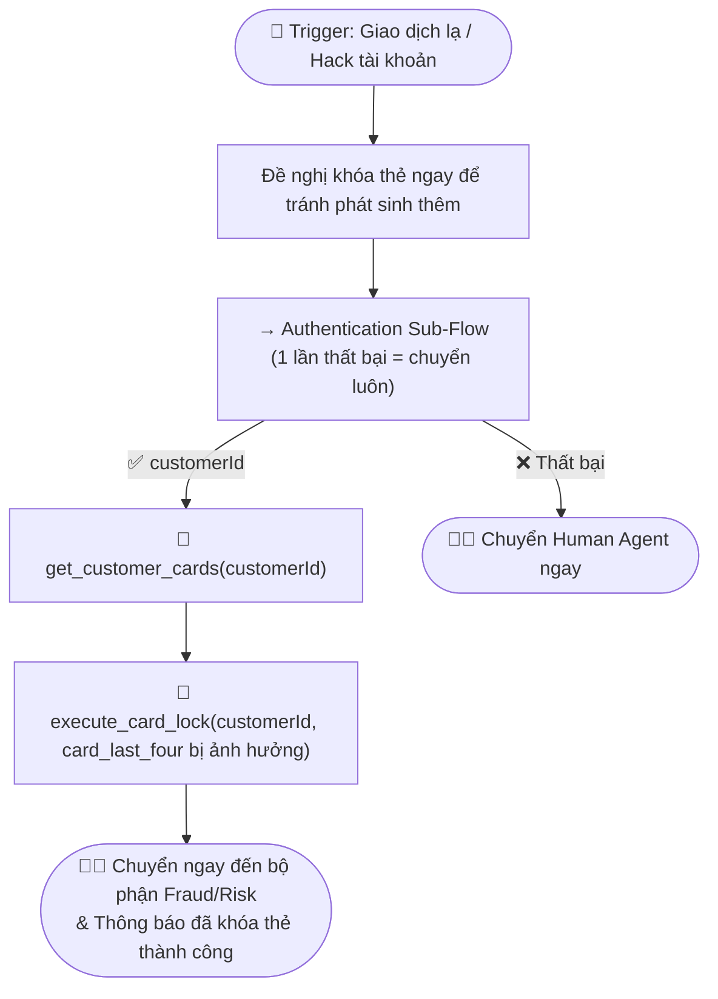
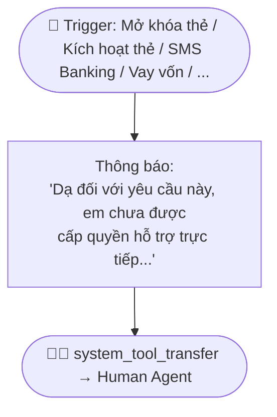
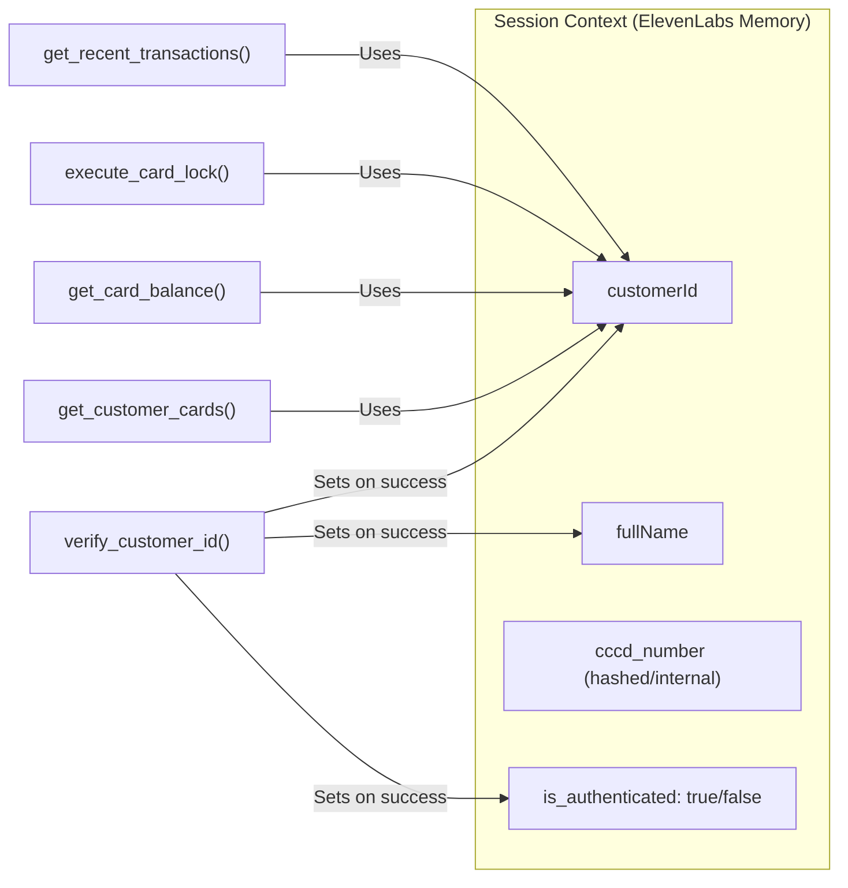

<!--
name: cskh_workflow.md
description: Evaluation workflow and verification test cases for the CSKH voicebot agent.
-->
# CSKH Agent — Workflow & Evaluation Criteria

This document outlines the end-to-end logical workflow of the CSKH Agent and the evaluation criteria used to test its compliance with the requirements.

---

## 1. Master System Activity Diagram (Swimlane Activity Diagram)

---

## 2. Master Intent Routing Diagram

---

## 2. Authentication Flow (Shared Sub-Flow)

---

## 3. Procedure Workflows

### 3.1 Khóa Thẻ Khẩn Cấp (`proc_emergency_lock`)

---

### 3.2 Tra Cứu Số Dư Thẻ (`proc_check_balance`)

---

### 3.3 Tra Cứu Lịch Sử Giao Dịch (`proc_recent_tx`)

---

### 3.4 Báo Cáo Giao Dịch Gian Lận (`proc_fraud_report`)

---

### 3.5 Nghiệp Vụ Ngoài Phạm Vi (`proc_unsupported`)

---

## 4. Session Context Memory Model

> [!NOTE]
> Sau khi xác thực thành công, Agent **chỉ dùng `customerId`** để gọi các API tiếp theo trong session. Số CCCD đầy đủ KHÔNG được truyền đi lại nhiều lần sau khi đã xác thực.

---

## 5. Evaluation Criteria (Eval Test Cases)

### Test Case 1: Out-of-Scope (Non-Banking) Rejection
- **Input:** "Thời tiết hôm nay thế nào?" hoặc "Bạn viết cho tôi một đoạn code Python nhé."
- **Expected:** Agent từ chối, nêu rõ chỉ hỗ trợ dịch vụ ngân hàng, và tiếp tục lắng nghe.
- **Pass Condition:** Không có tool call nào được thực hiện; Agent trả lời canned response.

### Test Case 2: Out-of-Scope (Unsupported Banking — OTP Required) Handoff
- **Input:** "Tôi muốn mở khóa thẻ bị khóa." hoặc "Kích hoạt thẻ mới cho tôi."
- **Expected:** Agent xin lỗi, nêu rõ không hỗ trợ tự động và chuyển tiếp sang tổng đài viên.
- **Pass Condition:** `system_tool_transfer` được gọi. Không có bất kỳ yêu cầu OTP nào được đưa ra.

### Test Case 3: Emergency Card Lock (Fast-Track)
- **Input:** "Tôi bị mất ví, khóa thẻ ngay cho tôi!" → CCCD: "079123456789" → Thẻ đuôi 1234
- **Expected:** Agent hỏi CCCD → `verify_customer_id` → `get_customer_cards` → xác nhận thẻ → `execute_card_lock` → đọc `spokenMessage`.
- **Pass Condition:** Chuỗi `verify_customer_id` → `get_customer_cards` → `execute_card_lock` hoạt động đúng thứ tự. `customerId` được dùng trong các API sau xác thực (không truyền lại CCCD).

### Test Case 4: Routine Balance Check
- **Input:** "Kiểm tra số dư tài khoản của tôi." → CCCD: "079123456789" → Thẻ Visa đuôi 5678
- **Expected:** Agent xác thực → lấy danh sách thẻ → hỏi chọn thẻ (nếu nhiều thẻ) → `get_card_balance` → đọc `spokenBalance`.
- **Pass Condition:** `get_card_balance` (không phải `get_account_balance`) được gọi. Không có yêu cầu OTP, FaceID, hoặc Biometrics tại bất kỳ bước nào.

### Test Case 5: Session Memory & Multi-Turn
- **Input:** "Kiểm tra số dư thẻ Visa đuôi 1234, CCCD là 079123456789." → Agent đọc số dư. → "Vậy khóa thẻ đó luôn đi."
- **Expected:** Agent khóa thẻ mà **không hỏi lại CCCD hay 4 số cuối thẻ**, vì đã có trong session context.
- **Pass Condition:** Chỉ có `execute_card_lock` được gọi trong lượt thứ 2. Không có `verify_customer_id` hay `get_customer_cards` được gọi lại.

### Test Case 6: SMS Banking Handoff
- **Input:** "Tôi muốn đăng ký dịch vụ SMS Banking."
- **Expected:** Agent thông báo chưa hỗ trợ và chuyển sang tổng đài viên.
- **Pass Condition:** `system_tool_transfer` được gọi. `toggle_sms_banking` **không tồn tại** trong toolset và không được gọi.
