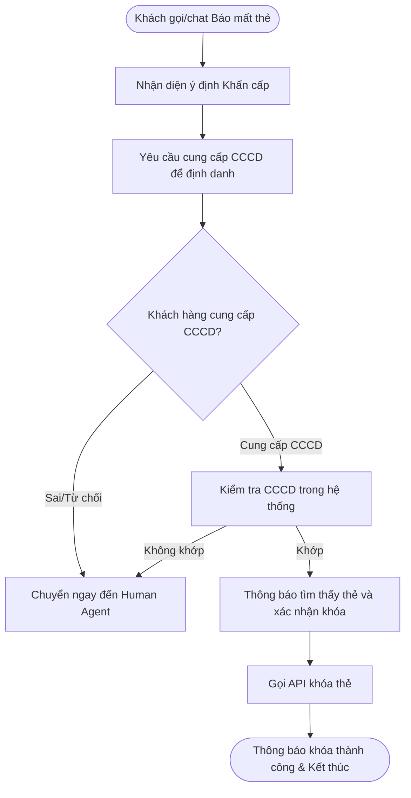
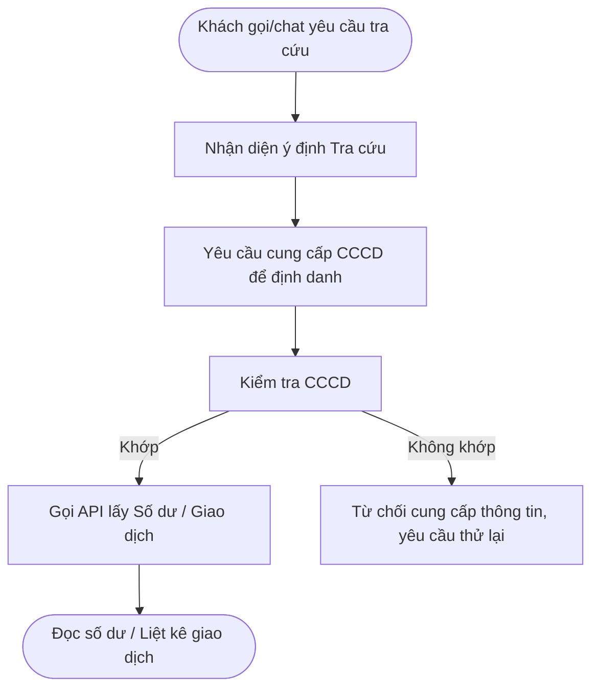

# Yêu Cầu Nghiệp Vụ — Trợ Lý Ảo Chăm Sóc Khách Hàng (CSKH Agent)

## 1. Tổng Quan Hệ Thống
*   **Phạm vi hoạt động:** Xử lý các luồng Inbound (khách hàng chủ động gọi vào qua Voice hoặc nhắn tin qua Chat).
*   **Nền tảng:** Sử dụng ElevenLabs Conversational AI cho phần Agent. Cả kênh Voice và Chat dùng chung một luồng logic (Flow), chỉ khác ở phương thức giao tiếp (Voice Text-To-Speech vs Chat Text).
*   **Mục tiêu chính:** Hỗ trợ các yêu cầu thường gặp như tra cứu số dư, tra cứu giao dịch, và ưu tiên xử lý khẩn cấp (khóa thẻ, báo mất thẻ).

---

## 2. Quy Tắc Cốt Lõi (Guardrails) & Xử Lý Out-of-Scope

Để đảm bảo an toàn và tính chuyên nghiệp, CSKH Agent bị ràng buộc bởi các quy tắc nghiêm ngặt:

1.  **Từ chối hoàn toàn chủ đề phi ngân hàng (Out-of-Scope - Non-Banking):** 
    *   Bất kể khách hàng cố gắng điều hướng cuộc trò chuyện, Agent không trả lời các câu hỏi về chính trị, giải trí, tư vấn đời sống, mã nguồn, v.v.
    *   *Kịch bản mẫu:* "Dạ em là trợ lý ảo của Ngân hàng SacomBank. Em chỉ có thể hỗ trợ các dịch vụ tài chính và ngân hàng của bên mình thôi ạ."
2.  **Từ chối nghiệp vụ chưa được cấu hình (Out-of-Scope - Unsupported Banking):**
    *   Nếu khách hàng yêu cầu các nghiệp vụ nằm trong phạm vi ngân hàng nhưng Agent chưa được hướng dẫn xử lý (ví dụ: tư vấn vay vốn doanh nghiệp, mở L/C, khiếu nại giao dịch phức tạp), hệ thống sẽ từ chối tự xử lý.
    *   *Kịch bản mẫu:* "Dạ đối với yêu cầu này, em chưa được cấp quyền hỗ trợ trực tiếp. Để thông tin chính xác nhất, em xin phép chuyển tiếp cuộc trò chuyện của mình đến chuyên viên tư vấn của ngân hàng ạ." (Sau đó thực hiện thao tác Handoff/Transfer).
3.  **Quản lý Ngữ cảnh (Context Memory):**
    *   ElevenLabs Agent sẽ tự động quản lý và lưu giữ ngữ cảnh (session context). Không cần gọi thêm API ngoài (như `save_session_context`) để lưu thông tin sau khi xác thực.

---

## 3. Quy Trình Xác Thực Danh Tính (Định Danh)

Quy trình xác thực là rào cản bắt buộc trước khi thực hiện mọi hành động truy xuất hay thay đổi dữ liệu của khách hàng.

*   **Phương thức duy nhất (In-Scope):** Bắt buộc hỏi **Số Căn Cước Công Dân (CCCD)** trước.
    *   Đối với các nghiệp vụ tra cứu rủi ro thấp (kiểm tra số dư): Có thể yêu cầu 4 số cuối CCCD + Năm sinh.
    *   Đối với các nghiệp vụ như khóa thẻ: Yêu cầu cung cấp CCCD để đảm bảo tính khẩn cấp nhưng vẫn chính xác.
*   **Các phương thức bị loại bỏ (Out-of-Scope):** Tuyệt đối **không yêu cầu** khách hàng xác thực bằng Sinh trắc học (Biometrics/FaceID) hoặc đọc mã OTP qua Chat/Voice ở cấp độ Agent này.
*   **Hành động sau xác thực:** Khi khách hàng cung cấp CCCD và hệ thống tra cứu hợp lệ, Agent xác nhận lại thông tin chủ tài khoản và tự động ghi nhớ dữ liệu này cho các luồng xử lý tiếp theo trong toàn bộ session.

---

## 4. Kịch Bản & Luồng Xử Lý (Workflows)

### Luồng 1: Báo Mất Thẻ / Khóa Thẻ Khẩn Cấp (Fast-Track)

**Kịch bản hội thoại:**
*   **KH:** "Tôi bị mất ví, hãy khóa thẻ ngay cho tôi!"
*   **Bot:** "Dạ anh/chị bình tĩnh nhé, em sẽ hỗ trợ khóa thẻ ngay lập tức. Để xác thực, anh/chị vui lòng cho em biết số Căn cước công dân của mình ạ."
*   **KH:** "Số CCCD của tôi là 079...1234."
*   **Bot:** "Dạ em đã kiểm tra thông tin khớp với khách hàng Nguyễn Văn A. Hệ thống ghi nhận anh đang có 1 thẻ Visa đuôi 4568. Em đang thực hiện khóa thẻ ngay lập tức... Dạ thẻ của anh đã được khóa thành công và an toàn ạ."

### Luồng 2: Tra Cứu Thông Tin Tài Khoản / Số Dư

**Kịch bản hội thoại:**
*   **KH:** "Kiểm tra cho tôi xem tài khoản còn bao nhiêu tiền?"
*   **Bot:** "Dạ để bảo mật thông tin tài khoản, anh/chị vui lòng cung cấp số Căn cước công dân trước khi em kiểm tra số dư nhé."
*   **KH:** "0123...456."
*   **Bot:** "Dạ em cảm ơn anh Nguyễn Văn A. Số dư khả dụng trong tài khoản của anh hiện tại là hai mươi lăm triệu đồng ạ."
*   **KH:** "Thế ngân hàng có chương trình cho vay mua nhà lãi suất bao nhiêu?" *(Out of scope - Unsupported)*
*   **Bot:** "Dạ hiện tại em chưa được hướng dẫn chi tiết về các gói vay mua nhà. Để nhận thông tin chính xác nhất, em xin phép nối máy anh đến chuyên viên tư vấn tín dụng nhé."
