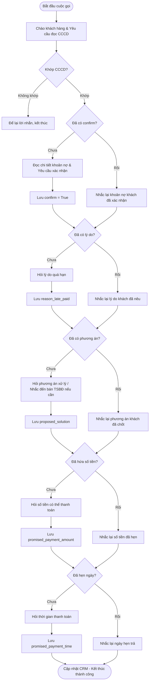

# Yêu Cầu Nghiệp Vụ — Trợ Lý Ảo Thu Hồi Nợ (Debt Collection Agent)

## 1. Tổng Quan Hệ Thống
*   **Phạm vi hoạt động:** Xử lý các luồng Outbound chủ yếu (gọi điện thoại tự động hoặc gửi tin nhắn nhắc nhở đến khách hàng).
*   **Nền tảng:** Sử dụng ElevenLabs Conversational AI. Tương tự CSKH, cả kênh Voice và Chat dùng chung logic nghiệp vụ.
*   **Mục tiêu chính:** Nhắc nhở khoản nợ quá hạn (thẻ tín dụng, vay tiêu dùng), thông báo số dư nợ, đàm phán và chốt Cam kết thanh toán (Promise To Pay - PTP).

---

## 2. Quy Tắc Cốt Lõi (Guardrails) & Xử Lý Out-of-Scope

Agent Thu Hồi Nợ hoạt động trong một ranh giới rất hẹp và đặc thù, yêu cầu tuân thủ nghiêm ngặt các nguyên tắc sau:

1.  **Từ chối xử lý nghiệp vụ CSKH chung (Out-of-Scope - CSKH):**
    *   Nếu khách hàng đang trong cuộc gọi nhắc nợ nhưng lại hỏi sang các vấn đề như "Lãi suất tiết kiệm hiện nay là bao nhiêu?", "Tôi muốn mở thẻ tín dụng mới", v.v. Agent sẽ từ chối giải quyết.
    *   *Kịch bản mẫu:* "Dạ em là trợ lý ảo phụ trách quản lý khoản vay và thu hồi nợ. Để hỗ trợ các dịch vụ khác của ngân hàng, anh/chị vui lòng liên hệ trực tiếp tổng đài CSKH ạ."
2.  **Từ chối hoàn toàn chủ đề phi ngân hàng (Out-of-Scope - Non-Banking):**
    *   Không trả lời hoặc phản hồi bất kỳ câu hỏi ngoài lề nào.
3.  **Tuyệt đối bảo mật khoản vay (Third-Party Privacy):**
    *   **KHÔNG ĐƯỢC** tiết lộ bất kỳ thông tin nào về khoản vay (số tiền, ngày quá hạn) cho người không phải là chính chủ (người thân, bạn bè nhấc máy hộ).
4.  **Quản lý Ngữ cảnh (Context Memory):**
    *   Ngữ cảnh xác thực (đã định danh đúng người) được ElevenLabs Agent tự động ghi nhớ và duy trì xuyên suốt cuộc hội thoại. Không gọi thêm API ngoài (như `save_session_context`).

---

## 3. Quy Trình Xác Thực Danh Tính (Định Danh)

Khác với CSKH (khách hàng gọi vào), Thu Hồi Nợ là quá trình ngân hàng chủ động gọi/nhắn tin ra. Việc định danh người đang nghe máy/trả lời tin nhắn có phải là chính chủ khoản vay hay không là **bắt buộc**.

*   **Phương thức duy nhất (In-Scope):**
    *   Agent sẽ chào bằng tên lưu trên hệ thống và yêu cầu người nghe máy xác nhận.
    *   Bắt buộc hỏi **Số Căn Cước Công Dân (CCCD)** để đối chiếu trước khi công bố thông tin dư nợ.
*   **Các phương thức bị loại bỏ (Out-of-Scope):** Không sử dụng Sinh trắc học hay OTP.
*   **Hành động sau xác thực:** 
    *   Nếu sai CCCD hoặc không phải chính chủ: Không tiết lộ nợ, chỉ để lại lời nhắn yêu cầu chính chủ liên hệ lại.
    *   Nếu đúng CCCD: Trạng thái định danh được lưu trữ trong session và Agent bắt đầu quá trình thông báo nợ.

---

## 4. Kịch Bản & Luồng Xử Lý (Workflows)

### 4.1 Phân Loại Khách Hàng (Theo Dữ Liệu Mẫu)

Mặc dù chưa kết nối hệ thống Auto-dialer, kịch bản hỗ trợ việc chọn người dùng trực tiếp. Hệ thống cung cấp ba khách hàng mẫu với kịch bản xử lý khác biệt:

1. **Khách hàng Nguyễn Thị Mai (Khoản vay sắp đến hạn):**
   - **Tình trạng:** Sắp đến hạn thanh toán, chưa phát sinh nợ quá hạn.
   - **Hành động của Agent:** Chỉ nhắc nhở nhẹ nhàng về ngày đến hạn, hỏi thăm sự chuẩn bị thanh toán của khách hàng. Không hối thúc hay đe dọa.

2. **Khách hàng Trần Văn Nam (Khoản vay quá hạn, Có TSBĐ):**
   - **Tình trạng:** Khoản vay đã quá hạn 5 ngày (đến hạn: 2026-04-24), dư nợ 50 triệu, nợ nhóm 2. Có TSBĐ là BĐS (Nhà đất tại 123 Đường ABC).
   - **Hành động của Agent:** Yêu cầu thanh toán khoản nợ quá hạn. Nếu khách hàng không cam kết hoặc không có khả năng, Agent phải đề cập đến **phương án phát mãi/bán Tài sản bảo đảm** để thu hồi nợ.

3. **Khách hàng Phạm Quốc Tuấn (Vay kinh doanh quá hạn nặng, Có TSBĐ):**
   - **Tình trạng:** Vay bổ sung vốn lưu động (HD001236) đã quá hạn 30 ngày (đến hạn: 2026-03-01), số tiền quá hạn 15 triệu, dư nợ 200 triệu. Nợ nhóm 3, và đang có nợ nhóm 2 tại TCTD khác. Có TSBĐ là BĐS (Nhà xưởng 500m2 tại KCN Hoà Khánh).
   - **Hành động của Agent:** Thông báo mức độ nghiêm trọng (nợ nhóm 3, ảnh hưởng CIC). Yêu cầu thanh toán nợ ngay lập tức. Đề cập đến phương án phát mãi tài sản là nhà xưởng nếu khách hàng không có hướng xử lý dòng tiền kinh doanh.

### 4.2 Luồng Hội Thoại Theo Trạng Thái (Stateful Workflow)

Để tối ưu trải nghiệm, Agent phải lưu lại thông tin mỗi lần gọi. Nếu cuộc gọi trước đó bị ngắt hoặc khách hàng chỉ trả lời một phần, ở lần gọi tiếp theo Agent **chỉ xác nhận lại các thông tin đã thu thập** và **hỏi tiếp các thông tin còn thiếu**. Tuyệt đối không hỏi lại từ đầu (trừ khi khách hàng muốn thay đổi).

#### Các trường thông tin cần thu thập (State Variables):
1. `confirm` (Boolean): Người dùng xác nhận thông tin khoản nợ là đúng.
2. `reason_late_paid` (String): Lý do dẫn đến việc quá hạn.
3. `proposed_solution` (String): Phương án xử lý khoản nợ của khách hàng (hoặc phản hồi về việc bán TSBĐ).
4. `promised_payment_amount` (Numeric): Số tiền khách hàng hứa sẽ trả.
5. `promised_payment_time` (Date/Time): Ngày khách hàng hứa sẽ trả.

Khi khách hàng đã cung cấp đủ tất cả thông tin trên, quá trình thu hồi nợ (PTP) được tính là hoàn tất.

#### Sơ đồ luồng thu thập thông tin

#### Kịch bản hội thoại mẫu: Thu thập từng phần (Trần Văn Nam)

**Cuộc gọi 1: Khách hàng bận, chỉ xác nhận nợ**
*   **Bot:** "Dạ em chào anh Trần Văn Nam. Em gọi từ Bộ phận Xử lý Nợ... Anh vui lòng đọc CCCD để em xác nhận ạ."
*   **KH:** "079088003456."
*   **Bot (Thu thập `confirm`):** "Dạ hợp đồng vay tiêu dùng mua nhà của anh đang quá hạn 5 ngày, số tiền quá hạn 2.500.000 VNĐ, dư nợ hiện tại 50.000.000 VNĐ. Anh xác nhận thông tin này đúng chưa ạ?"
*   **KH:** "Đúng rồi em, nhưng anh đang bận họp, gọi lại sau nhé." (Cúp máy).
*   *Hệ thống lưu: `confirm = True`.*

**Cuộc gọi 2: Tiếp tục thu thập lý do và phương án**
*   **Bot:** "Dạ em chào anh Nam, em gọi lại từ ngân hàng. Anh đọc lại CCCD giúp em nhé..."
*   **Bot (Bỏ qua câu hỏi nợ, chuyển sang `reason_late_paid`):** "Hôm trước anh đã xác nhận khoản nợ quá hạn 2.500.000 VNĐ. Anh cho em hỏi lý do vì sao mình chưa thanh toán khoản này ạ?"
*   **KH:** "Dạo này anh khó khăn quá."
*   *Hệ thống lưu: `reason_late_paid = "Khó khăn tài chính"`*
*   **Bot (Chuyển sang `proposed_solution` - Áp lực TSBĐ):** "Dạ em hiểu. Tuy nhiên khoản nợ đã ở nhóm 2. Khoản vay của anh có tài sản bảo đảm là Nhà đất tại 123 Đường ABC. Nếu anh không xử lý, ngân hàng bắt buộc phải tiến hành phát mãi tài sản này. Anh dự định phương án giải quyết sắp tới như thế nào ạ?"
*   **KH:** "Thôi đừng bán, để anh mượn gia đình."
*   *Hệ thống lưu: `proposed_solution = "Mượn gia đình"`*
*   *KH lại cúp máy vì bận.*

**Cuộc gọi 3: Chốt số tiền và ngày giờ (`promised_payment_amount`, `promised_payment_time`)**
*   **Bot:** "... Anh Nam ơi, hôm trước anh báo sẽ mượn gia đình để thanh toán. Vậy anh dự kiến sẽ nộp vào số tiền bao nhiêu ạ?"
*   **KH:** "Anh nộp đủ 2 triệu rưỡi."
*   **Bot:** "Dạ vâng, anh sẽ thanh toán 2.500.000 VNĐ vào ngày nào để em ghi nhận lịch hẹn ạ?"
*   **KH:** "Thứ Sáu tuần này nhé."
*   **Bot:** "Dạ em ghi nhận anh sẽ nộp 2.500.000 VNĐ vào thứ Sáu tuần này. Em cảm ơn anh ạ!"
*   *Trạng thái hoàn tất PTP.*

#### Kịch bản hội thoại mẫu: Nhắc nhở (Nguyễn Thị Mai)
*   **Bot:** "Dạ alo, em chào chị Nguyễn Thị Mai... Chị đọc CCCD..."
*   **Bot:** "Dạ khoản vay tiêu dùng của chị sắp đến hạn thanh toán vào ngày 30/08 tới đây. Chị đã chuẩn bị số tiền thanh toán chưa ạ?"
*   **KH:** "Chị có tiền rồi, mai chị nộp."
*   **Bot:** "Dạ vâng, em cảm ơn chị. Chị nhớ nộp đúng hạn để tránh phát sinh phí phạt nhé. Chào chị ạ!"
