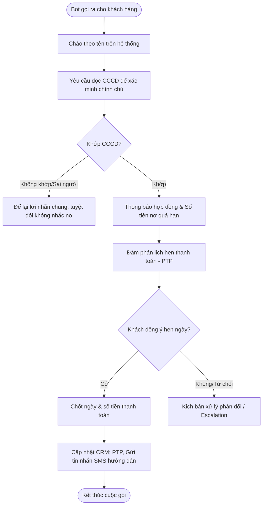
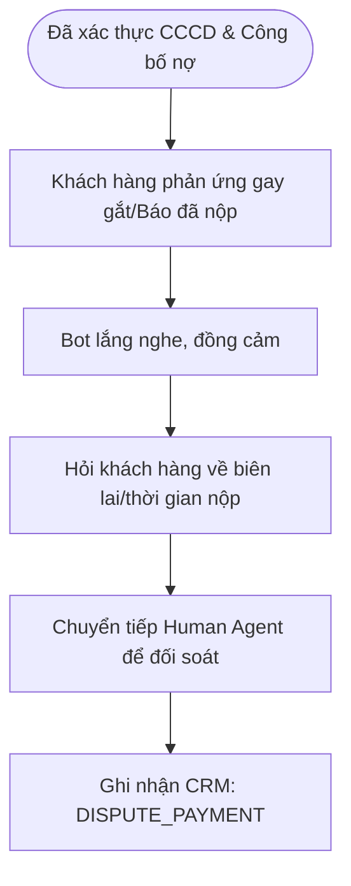

# Yêu Cầu Nghiệp Vụ — Trợ Lý Ảo Thu Hồi Nợ (Debt Collection Agent)

## 1. Tổng Quan Hệ Thống
*   **Phạm vi hoạt động:** Xử lý các luồng Outbound chủ yếu (gọi điện thoại tự động hoặc gửi tin nhắn nhắc nhở đến khách hàng).
*   **Nền tảng:** Sử dụng ElevenLabs Conversational AI. Tương tự CSKH, cả kênh Voice và Chat dùng chung logic nghiệp vụ.
*   **Mục tiêu chính:** Nhắc nhở khoản nợ quá hạn (thẻ tín dụng, vay tiêu dùng), thông báo số dư nợ, đàm phán và chốt Cam kết thanh toán (Promise To Pay - PTP).

---

## 2. Quy Tắc Cốt Lõi (Guardrails) & Xử Lý Out-of-Scope

Agent Thu Hồi Nợ hoạt động trong một ranh giới rất hẹp và đặc thù, yêu cầu tuân thủ nghiêm ngặt các nguyên tắc sau:

1.  **Từ chối xử lý nghiệp vụ CSKH chung (Out-of-Scope - CSKH):**
    *   Nếu khách hàng đang trong cuộc gọi nhắc nợ nhưng lại hỏi sang các vấn đề như "Lãi suất tiết kiệm hiện nay là bao nhiêu?", "Tôi muốn mở thẻ tín dụng mới", v.v. Agent sẽ từ chối giải quyết.
    *   *Kịch bản mẫu:* "Dạ em là trợ lý ảo phụ trách quản lý khoản vay và thu hồi nợ. Để hỗ trợ các dịch vụ khác của ngân hàng, anh/chị vui lòng liên hệ trực tiếp tổng đài CSKH ạ."
2.  **Từ chối hoàn toàn chủ đề phi ngân hàng (Out-of-Scope - Non-Banking):**
    *   Không trả lời hoặc phản hồi bất kỳ câu hỏi ngoài lề nào.
3.  **Tuyệt đối bảo mật khoản vay (Third-Party Privacy):**
    *   **KHÔNG ĐƯỢC** tiết lộ bất kỳ thông tin nào về khoản vay (số tiền, ngày quá hạn) cho người không phải là chính chủ (người thân, bạn bè nhấc máy hộ).
4.  **Quản lý Ngữ cảnh (Context Memory):**
    *   Ngữ cảnh xác thực (đã định danh đúng người) được ElevenLabs Agent tự động ghi nhớ và duy trì xuyên suốt cuộc hội thoại. Không gọi thêm API ngoài (như `save_session_context`).

---

## 3. Quy Trình Xác Thực Danh Tính (Định Danh)

Khác với CSKH (khách hàng gọi vào), Thu Hồi Nợ là quá trình ngân hàng chủ động gọi/nhắn tin ra. Việc định danh người đang nghe máy/trả lời tin nhắn có phải là chính chủ khoản vay hay không là **bắt buộc**.

*   **Phương thức duy nhất (In-Scope):**
    *   Agent sẽ chào bằng tên lưu trên hệ thống và yêu cầu người nghe máy xác nhận.
    *   Bắt buộc hỏi **Số Căn Cước Công Dân (CCCD)** để đối chiếu trước khi công bố thông tin dư nợ.
*   **Các phương thức bị loại bỏ (Out-of-Scope):** Không sử dụng Sinh trắc học hay OTP.
*   **Hành động sau xác thực:** 
    *   Nếu sai CCCD hoặc không phải chính chủ: Không tiết lộ nợ, chỉ để lại lời nhắn yêu cầu chính chủ liên hệ lại.
    *   Nếu đúng CCCD: Trạng thái định danh được lưu trữ trong session và Agent bắt đầu quá trình thông báo nợ.

---

## 4. Kịch Bản & Luồng Xử Lý (Workflows)

### Luồng 1: Nhắc Nợ & Chốt Cam Kết Thanh Toán (PTP)

**Kịch bản hội thoại:**
*   **Bot:** "Dạ alo, em chào anh Lê Hoàng Long. Em gọi từ Bộ phận Quản lý Khách hàng của Ngân hàng SacomBank. Để đảm bảo tính bảo mật, anh vui lòng đọc số Căn cước công dân của mình để em xác nhận trước khi trao đổi thông tin ạ."
*   **KH:** "Tôi đọc này... 00123...789."
*   **Bot (Xác nhận khớp):** "Dạ em cảm ơn anh Long. Em liên hệ để thông báo hợp đồng vay tiêu dùng của anh đang quá hạn 5 ngày với số tiền hai triệu đồng. Anh dự kiến thanh toán khoản này vào ngày nào ạ?"
*   **KH:** "Mai tôi thanh toán nhé."
*   **Bot:** "Dạ em ghi nhận lịch hẹn thanh toán của anh là ngày mai với số tiền hai triệu đồng. Hệ thống sẽ tự động lưu lại xác nhận này. Em chào anh ạ!"

### Luồng 2: Xử Lý Tranh Chấp & Từ Chối Nợ

**Kịch bản hội thoại:**
*   **KH:** "Này, tôi đã thanh toán ở ATM tuần trước rồi, sao cứ gọi mãi thế?"
*   **Bot:** "Dạ em rất xin lỗi vì sự bất tiện này. Anh cho em hỏi anh nộp tiền vào thời gian nào để em kiểm tra ngay giúp anh ạ?"
*   **KH:** "Tôi nộp thứ 6 tuần trước rồi. Cho tôi gặp nhân viên giải quyết đi!"
*   **Bot:** "Dạ em hiểu sự khó chịu của anh. Để đối soát chính xác, em xin phép nối máy ngay đến chuyên viên xử lý khiếu nại ạ. Anh vui lòng giữ máy." (Thực hiện Escalation / Handoff).
